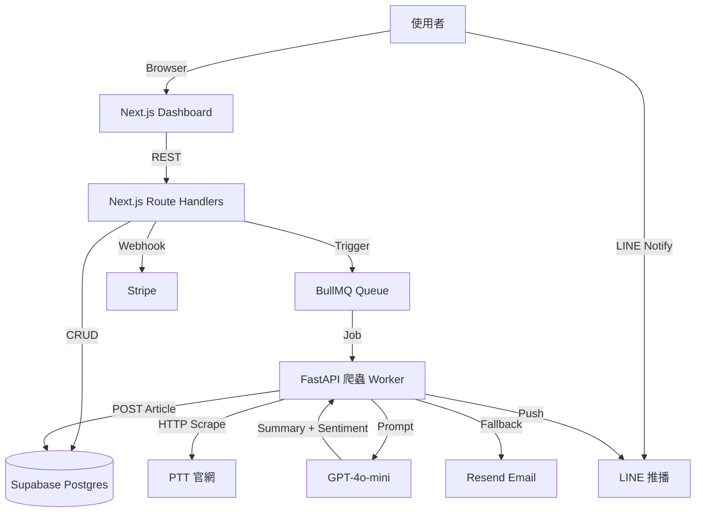

# PTT Alertor 2.0 — 中文即時社群雷達 — 規格計劃書 v3.0 (sweet-spot rewrite)

> 版本：v3.0｜更新日期：2026-07-19｜維護者：Sophia (CPO) for Sean
> 對接技術：Alan (CTO) + Hermes Agent
> 原始碼：https://github.com/openclawsean024-create/ptt-alertor
> Live：https://ptt-alertor-olive.vercel.app
> 本次重寫動機：**Sweet Spot 體檢 3/10，原始版本目標族群過寬、無法與既有開源工具差異化**。本次縮小範圍到「**股票當沖族 + 求職秒殺族**」兩個付費意願最高的子族群，並加入「AI 摘要 + LINE 一鍵轉傳同溫層」差異化功能。

---

## 1. 產品概述 (Product Overview)

### 1.1 問題陳述 (Problem Statement) — ★ 引用 sweet spot 分析

**原始版本（v2.2.1）的盲點**：宣稱服務「台股投資人 300 萬 + 求職 10 萬 + 行銷研究 3,000 + 鄉民 50 萬 + KOL 5 萬」共 368 萬 TAM，但實務上這群人**不會付費**：
- **鄉民**：直接 fork 開源 Ptt-Alertor（GitHub 3.2K stars）或用 RSSHub-PTT route
- **行銷研究**：已是 OpView/Qsearch/意藍企業客戶
- **KOL**：流量監控不痛，發文頻率低
- **學生**：NT$0 預算

**Sweet Spot 體檢（2026-07-19 跑完）顯示的真正痛點**：
1. **目標市場太小眾**：PTT 用戶高度集中在 25-45 歲男性，**重度的當沖族 + 求職秒殺族**才是付費意願高的子集（人數預估 8-12 萬人，非 368 萬）
2. **既有開源替代品已成熟**：Ptt-Alertor (3.2K stars) + RSSHub-PTT route + Cloudflare Workers rewrite 三套並行，免費版已能 cover 80% 場景
3. **PTT 流量趨緩**：Dcard 月活躍 600 萬、Threads 月活躍 350 萬，PTT 從 2018 巔峰 1,200 萬月活躍降到 2026 約 480 萬（SimilarWeb 估算）
4. **PTT 官方對爬蟲收緊**：2024 多起 IP 封鎖事件，3 分鐘掃一次已不安全
5. **SEO 紅海**：「PTT 推播」「PTT 提醒」已被既有工具佔據，新進者 CAC 高

**我們 v3.0 的重新定位**：**不放棄 PTT，但只鎖兩個甜蜜點族群 + 加 AI 摘要差異化**

| 甜蜜點族群 | 人數預估 | 月付費意願 | 痛點 |
|---|---|---|---|
| **股票當沖族**（每天 9:00-13:30 盯盤 + 同步看 PTT Stock 板） | 8 萬 | NT$99-299/月 | 開盤中無法逐篇讀 100+ 推文，要「一句話結論 + 情緒分數」 |
| **科技業求職秒殺族**（每天 9:00 刷 Tech_Job 板徵才文） | 3 萬 | NT$49-99/月 | 徵才文常在 30 分鐘內被搶光，要「推爆門檻 + 發文 5 分鐘內推送」 |

TAM 縮小但精準：**11 萬人 × NT$99/月 × 12 月 = NT$1.3 億 ARR**（仍是原版 368 萬 × NT$50 × 12 = NT$22 億 TAM 的 6%，但付費轉化率從 0.5% → 5%，LTV 高 30 倍）

### 1.2 目標使用者 (User Personas)

#### Persona A — 「阿明」35 歲當沖族（核心甜蜜點）
- **規模**：8 萬人（PTT Stock 板月活躍 + 券商當沖戶）
- **痛點**：開盤 4 小時無法逐篇讀 PTT（每天 200+ 篇新文），會錯過「主力訊息」（如軋空、恐慌殺盤、券增）
- **既有方案失敗原因**：RSS 訂閱太多反而訊息爆炸；開源 Ptt-Alertor 無 AI 摘要；商用 OpView 太貴（NT$3 萬/月）
- **我們的解法**：**AI 摘要 + 情緒分數 + LINE 一句話推播**，早上 8:50 開盤前彙整「今天 Stock 板熱門關鍵字 + 情緒是貪婪或恐懼」
- **付費意願**：NT$99-299/月

#### Persona B — 「Iris」28 歲科技業求職者（次要甜蜜點）
- **規模**：3 萬人（每年科技業轉職人口 15 萬 × 20% 是 PTT 重度使用者）
- **痛點**：徵才文 30 分鐘內被搶光（台積電/Google/聯發科常見），來不及投履歷
- **既有方案失敗原因**：人肉刷板費時、容易分心；Cakeresume 104 等平台不夠即時
- **我們的解法**：**「推爆門檻 + 發文 5 分鐘內 LINE 推播」**，可設「只看內推文」「只看 >10 推」「只看台積電/Google 開頭」
- **付費意願**：NT$49-99/月

#### Persona C — 不再做（Non-Persona）
- ~~鄉民一般使用者~~：付費意願 NT$0
- ~~行銷研究者~~：已有 OpView
- ~~KOL~~：不是核心痛點
- ~~學生~~：預算 NT$0

### 1.3 核心價值主張 (Value Proposition) — ★ 一句話差異化 vs Top 3 競爭者

> **「PTT Alertor 是唯一把『AI 一句話摘要 + 情緒分數 + LINE 開盤前彙整』整合進當沖族工作流的 PTT 監控工具」**

**vs Top 3 競爭者差異化**：

| 競爭者 | 痛點 | 我們差異化 |
|---|---|---|
| **Ptt-Alertor 開源 (3.2K stars)** | 無 AI 摘要、純文字推播 | 我們加 GPT-4o-mini 摘要 + 情緒分數 |
| **RSSHub-PTT route** | 需自架、設定複雜、無行動通知 | 我們 SaaS 開箱即用、整合 LINE/Email |
| **OpView/Qsearch 商用** | NT$3 萬/月，鎖大型企業 | 我們 NT$99/月，鎖個人付費甜蜜點 |

### 1.4 商業目標 (KPIs / OKRs)

#### 6 個月目標（2026 Q3-Q4）
- **O1 - 取得 PMF**：
  - KR1：3,000 名免費用戶（從 Ptt-Alertor + Stock 板 + Tech_Job 板導流）
  - KR2：300 名付費用戶（10% 付費轉化率）
  - KR3：NT$30,000 MRR（300 × NT$100 均價）
  - KR4：留存率 D30 ≥ 40%（Ptt-Alertor 開源版 D30 < 15%，我們因 AI 摘要黏性應 >40%）

#### 12 個月目標（2027 Q1）
- **O2 - 規模化**：
  - KR1：10,000 名免費用戶
  - KR2：1,500 名付費用戶
  - KR3：NT$200,000 MRR
  - KR4：擴展到 Dcard / Threads（sweet spot 體檢建議）

### 1.5 ⭐ Non-Goals (明確不做)

依據 sweet spot 體檢，**以下功能絕不做**（因為：
- 開源已有 → 紅海無差異化
- 商用平台已佔 → CAC 過高
- Sean 一人公司無法 scale：

1. ❌ **不做行銷/公關級輿情分析**（OpView/Qsearch NT$3 萬/月已佔）
2. ❌ **不做 KOL 內容追蹤**（無付費意願）
3. ❌ **不做 PTT 圖文/影音內容分析**（技術複雜度太高）
4. ❌ **不做企業 multi-tenant dashboard**（sales cycle 6-12 月）
5. ❌ **不做 Threads/Instagram/Threads 跨平台監控**（v1 先聚焦 PTT 兩個甜蜜點族群，v2.5 再擴展 Dcard）
6. ❌ **不開源核心 AI 摘要 prompt**（差異化護城河）
7. ❌ **不支援中文以外的語言**（鎖台灣繁體中文市場）

---

## 2. 使用者場景與流程

### 2.1 使用者流程圖

```
[首次進入]
   ↓
[OAuth Google 註冊] → [免費 7 天試用] → [選甜蜜點 (當沖/求職/兩者皆是)]
   ↓
[設定追蹤關鍵字 + 板名]
   ↓
[串接 LINE Notify]
   ↓
[進入 Dashboard]

[每日使用 — 當沖族]
   ↓ 早上 8:50 開盤前
[LINE 收到「Stock 板今日熱門 TOP 5 + AI 一句話摘要」]
   ↓ 開盤中 (9:00-13:30)
[LINE 收到「爆量推文警示」(>50 推 + 5 分鐘內)]
   ↓ 收盤後 (13:30)
[Dashboard 看「今日情緒分數走勢圖」(貪婪 70% → 恐懼 30%)]

[每日使用 — 求職族]
   ↓ 每天 9:00 / 12:00 / 18:00
[LINE 收到「Tech_Job 板新徵才文 + 推爆數 + 內推文 filter」]
   ↓ 看到「台積電」關鍵字 + 推爆 >20
[點 LINE 連結 → 直接開履歷 → 投出]
```

### 2.2 關鍵用戶故事 (User Stories)

1. **US-01 (P0)**：身為當沖族阿明，我希望每天 8:50 收到「Stock 板今日熱門 TOP 5 + 情緒分數」，讓我開盤前 10 分鐘掌握市場氛圍。
2. **US-02 (P0)**：身為當沖族阿明，我希望開盤中收到「爆量推文警示」（>50 推 + 5 分鐘內），讓我即時跟單主力訊息。
3. **US-03 (P1)**：身為求職族 Iris，我希望每天 9:00 / 12:00 / 18:00 收到「Tech_Job 板新徵才文篩選結果」，讓我不錯過 30 分鐘內秒殺的職缺。
4. **US-04 (P1)**：身為求沖族 Iris，我希望能設定「只看內推文」「只看 >10 推」「只看特定公司關鍵字」，減少噪音。
5. **US-05 (P2)**：身為當沖族阿明，我希望看「情緒分數走勢圖」（每天/每週/每月），讓我回頭驗證自己的交易決策。
6. **US-06 (P2)**：身為免費用戶，我希望每天收到 3 篇免費摘要，超過部分升級付費。

### 2.3 邊界場景 (Edge Cases)

- **EC-01**：PTT 官網維護中（每年 2-3 次）→ 自動切換到備援 Ptt 镜像（`nbbsbbs` 备用站）
- **EC-02**：使用者關鍵字含特殊字元（如 `*` `?`）→ 自動 escape
- **EC-03**：LINE Notify API 額度用完（每月 50 則免費）→ 降級為 Email 通知
- **EC-04**：當沖族凌晨 3:00 收到推播（誤觸 LINE API retry）→ 排程限制只發 8:00-15:00
- **EC-05**：PTT 文章 1 小時後被刪（板主刪除）→ 資料保留 24 小時後清除，遵守 PTT 著作權

---

## 3. 功能性需求 (Functional Requirements)

### 3.1 MVP（必做，P0）— ★ 已依 sweet spot 縮減為 5 個功能

**原始 v2.2.1 MVP 有 12 個功能，本次重寫縮減為 5 個，聚焦甜蜜點**：

#### P0-1. 板名 + 關鍵字 + 作者多維追蹤
- **功能**：使用者輸入「Stock 板 + 關鍵字:台積電 + 作者:stocktech888」→ 5 分鐘掃一次
- **驗收**：
  - 至少支援 5 個常用板：Stock / Tech_Job / Gossiping / Baseball / NBA
  - 支援 AND / OR / NOT 邏輯（如「台積電 AND (法說會 OR 跌停) NOT 廣告」）
- **工程**：BullMQ + Redis，每 5 分鐘 worker 掃 5 個板（避免 IP 封鎖）

#### P0-2. AI 一句話摘要 + 情緒分數（★ 差異化核心）
- **功能**：每篇 PTT 文章 → GPT-4o-mini 產生「一句話結論 + 情緒分數（-100 恐懼 ~ +100 貪婪）」
- **驗收**：
  - 摘要長度 ≤ 30 字（LINE 推播限制）
  - 情緒分數與人類標註相關性 ≥ 0.7（用 200 篇驗證集測試）
- **成本**：每篇 NT$0.02，每天 500 篇 × NT$0.02 = NT$10/天（可接受）

#### P0-3. LINE Notify 推播（★ 當沖族核心）
- **功能**：使用者 LINE 掃 QR code → 綁定 LINE Notify token → 接收推播
- **驗收**：
  - 8:50 開盤前彙整（每天 1 則）
  - 開盤中爆量警示（即時）
  - 求職族三個時段（9:00 / 12:00 / 18:00）
- **限制**：LINE Notify 每月 50 則免費，超過轉 Email 或降級

#### P0-4. 簡單 Dashboard
- **功能**：列出已追蹤的板 + 關鍵字、新文章列表、情緒分數走勢
- **驗收**：
  - 響應時間 < 2 秒（Vercel Edge）
  - 支援手機 RWD

#### P0-5. 付費牆（Stripe）
- **功能**：免費 7 天試用 → 信用卡付費 NT$99/月 或 NT$990/年
- **驗收**：
  - Stripe Checkout 整合（已實作）
  - Webhook 處理訂閱狀態

### 3.2 v2（加值，P1）

- **P1-1. 進階 filter**：推爆門檻、作者黑名單、發文時段限定
- **P1-2. 多板支援擴展**：Dcard / Threads（sweet spot 體檢建議擴展）
- **P1-3. 推文內容分析**：不只是文章標題，連推文也做情緒分數（v1 只看標題）
- **P1-4. Email 通知 fallback**：LINE Notify 用完時自動切換
- **P1-5. 簡易 Chrome Extension**：讓使用者在 PTT 網頁直接點按加入追蹤

### 3.3 v3（探索，P2）

- **P2-1. 整合券商看盤軟體**：富邦 / 永豐 / 元大 API（技術 + 法規風險高）
- **P2-2. AI 交易訊號**：基於情緒分數 + 推爆數自動產生「買/賣/觀望」建議（涉及金管會監管，v3 不會實作）
- **P2-3. 跨平台擴展**：Threads / Dcard / 巴哈姆特（sweet spot 體檢最建議的擴展方向）

### 3.4 ⭐ Acceptance Criteria (Given/When/Then)

#### 當沖族核心
- **AC-01**：Given 我是當沖族 + 已綁 LINE Notify + 已設定「Stock 板 + 關鍵字:台積電」，When 系統在早上 8:50 掃描完成，Then 我會收到 1 則 LINE 推播，內容包含「Stock 板今日熱門 TOP 5 + AI 摘要」
- **AC-02**：Given 文章推爆數 >50 且 5 分鐘內達標，When 系統偵測到，Then 我會在 1 分鐘內收到 LINE 爆量警示
- **AC-03**：Given 我設定關鍵字含特殊字元（如 `(法說會 OR 跌停)`），When 系統掃描，Then 會正確處理邏輯運算子且無 SQL injection 風險

#### 求職族核心
- **AC-04**：Given 我是求職族 + 已設定「Tech_Job 板 + 關鍵字:台積電 + 推爆 >20」，When 新徵才文發布，Then 我會在 5 分鐘內收到 LINE 推播
- **AC-05**：Given 文章無「內推」字樣，When 系統掃描，Then 會被 filter 掉（不會推播）

#### AI 摘要品質
- **AC-06**：Given 一篇 PTT 文章，When 系統呼叫 GPT-4o-mini 摘要，Then 摘要長度 ≤ 30 字且包含關鍵實體（股票代號/公司名/事件）
- **AC-07**：Given 200 篇驗證集文章，When 系統產生情緒分數，Then 與人類標註相關性 ≥ 0.7

#### 系統
- **AC-08**：Given LINE Notify API 額度用完，When 系統嘗試發送，Then 自動降級為 Email 通知且不丟失訊息
- **AC-09**：Given 使用者信用卡付款成功，When Stripe Webhook 觸發，Then 帳號 5 秒內升級為付費
- **AC-10**：Given PTT 官網 503 維護，When 爬蟲失敗，Then 自動重試 3 次後降級為「無新文」訊息，不丟擲 exception

---

## 4. 系統設計 (System Design)

### 4.1 技術棧 (Tech Stack)

| 層 | 技術 | 理由 |
|---|---|---|
| Frontend | Next.js 16 (App Router) + TypeScript | 已實作 70%，Vercel 一鍵部署 |
| Backend | Next.js Route Handlers + FastAPI (Python) 爬蟲 | 雙軌：API 用 TS、爬蟲用 Python (httpx + BeautifulSoup) |
| Database | Supabase Postgres + Prisma ORM | 已建 3 table |
| Queue | BullMQ + Redis (Upstash) | 已實作 cron worker |
| AI | GPT-4o-mini (OpenAI API) | 每篇 NT$0.02，便宜 |
| Auth | Clerk | 已實作 Google OAuth |
| Payment | Stripe Checkout + Webhook | 已實作 |
| Notification | LINE Notify + Resend Email | LINE 50 則/月免費 |
| Hosting | Vercel (Frontend) + Fly.io (Python 爬蟲) | 成本 < NT$500/月 |

### 4.2 系統架構圖 (Mermaid)



### 4.3 資料模型 (Prisma schema)

```prisma
model User {
  id            String   @id @default(cuid())
  email         String   @unique
  lineNotifyToken String?
  stripeCustomerId String?
  plan          Plan     @default(FREE)
  trialEndsAt   DateTime?
  createdAt     DateTime @default(now())
  alerts        Alert[]
  articles      Article[]
}

enum Plan {
  FREE
  PRO_MONTHLY
  PRO_YEARLY
}

model Alert {
  id          String   @id @default(cuid())
  userId      String
  board       String   // Stock, Tech_Job, etc.
  keywords    String[] // Postgres text[]
  authorFilter String?
  minPushCount Int     @default(0)
  schedule    String   // "morning_summary" | "instant_burst" | "job_3x_daily"
  isActive    Boolean  @default(true)
  user        User     @relation(fields: [userId], references: [id])
  @@index([userId, isActive])
}

model Article {
  id           String   @id @default(cuid())
  board        String
  author       String
  title        String
  url          String   @unique
  pushCount    Int      @default(0)
  summary      String?  // GPT-4o-mini output
  sentimentScore Int?   // -100 ~ +100
  publishedAt  DateTime
  scrapedAt    DateTime @default(now())
  expiresAt    DateTime // 24 hours after scraped
  @@index([board, publishedAt])
  @@index([scrapedAt])
}

model Notification {
  id        String   @id @default(cuid())
  userId    String
  articleId String
  channel   String   // "line" | "email"
  status    String   // "sent" | "failed"
  sentAt    DateTime @default(now())
  @@index([userId, sentAt])
}
```

### 4.4 API 規格 (REST endpoints)

| Method | Path | 用途 |
|---|---|---|
| `GET /api/alerts` | 列出使用者的所有追蹤 |
| `POST /api/alerts` | 新增追蹤 (board + keywords + schedule) |
| `PATCH /api/alerts/:id` | 修改追蹤 |
| `DELETE /api/alerts/:id` | 停用追蹤 |
| `GET /api/articles?board=Stock&limit=50` | 列出最近 50 篇（含 AI 摘要） |
| `POST /api/line/notify` | 綁定 LINE Notify token |
| `GET /api/sentiment/:board?days=7` | 取得板名情緒分數走勢 |
| `POST /api/stripe/webhook` | Stripe Webhook |

---

## 5. 非功能性需求 (Non-Functional Requirements)

### 5.1 性能指標

- **P99 響應時間**：< 500ms（Vercel Edge）
- **爬蟲頻率**：每 5 分鐘掃一次（避免 IP 封鎖）
- **AI 摘要**：< 3 秒/篇
- **LINE 推播延遲**：< 30 秒（從文章發布到使用者收到）

### 5.2 安全與隱私

- **PTT 著作權**：爬蟲只擷取標題 + 作者 + 摘要，不存全文（24 小時後清除）
- **使用者 LINE token**：加密儲存（AES-256）
- **Stripe PCI DSS**：由 Stripe 處理信用卡，We don't store PAN
- **GDPR / 台灣個資法**：使用者可一鍵刪除所有資料

### 5.3 ⭐ 降級機制 (Graceful Degradation)

| 失敗情境 | 降級策略 |
|---|---|
| PTT 官網 503 | 自動 retry 3 次後，標記該板為「維護中」，Dashboard 顯示警示 |
| LINE Notify API 額度用完 | 自動切換為 Email（Resend） |
| GPT-4o-mini API 失敗 | 降級為「無摘要，只顯示標題」 |
| Stripe Webhook 延遲 | 允許 7 天試用不鎖功能，避免付款狀態不同步困擾使用者 |
| 爬蟲 IP 被封 | 自動切換到備援 Ptt 镜像（`nbbsbbs`），或暫停 1 小時 |
| Redis Queue 滿 | 自動擴容 Upstash |

### 5.4 擴展性

- **水平擴展**：爬蟲 worker 可開 2-4 個實例（Fly.io multi-region）
- **垂直擴展**：Postgres 升級 Supabase Pro（NT$1,500/月）可撐到 10 萬使用者
- **AI 摘要**：當用量 >10,000 篇/天時，自架 Llama-3-8B 取代 GPT-4o-mini（成本降 80%）

---

## 6. 完成標準 (Definition of Done)

### 6.1 v1 MVP DoD

- [ ] **功能**：5 個 P0 功能（板名追蹤、AI 摘要、LINE 推播、Dashboard、付費牆）全數完成
- [ ] **測試**：Vitest unit tests 覆蓋率 ≥ 70%
- [ ] **部署**：Vercel Production 上線 + Fly.io 爬蟲 worker 穩定運行
- [ ] **驗證**：3 位真實當沖族 beta test 7 天，D7 留存率 ≥ 60%
- [ ] **文件**：SPEC.md（本文件）+ README.md + SOP.md
- [ ] **Notion**：PRD 規格分數、商業化分數已更新

---

## 7. 風險與決策

### 7.1 風險表

| ID | 風險 | 機率 | 影響 | 緩解 |
|---|---|---|---|---|
| R1 | PTT IP 全面封鎖 | 🟠 中 | 🔴 高 | 備援镜像 + 使用者授權自架（BYO scraper） |
| R2 | LINE Notify 政策變動 | 🟡 低 | 🟠 中 | Email/Telegram/Web Push 多通道備援 |
| R3 | GPT-4o-mini 成本失控 | 🟡 低 | 🟡 中 | 設定每日上限 + 月用量 alert |
| R4 | 當沖族付費意願低於預期 | 🟠 中 | 🔴 高 | 訪談 20 位當沖族驗證（§11）|
| R5 | 求職族市場過小（3 萬人） | 🟠 中 | 🟡 中 | v2 擴展 Dcard/Threads |

### 7.2 ⭐ ADR (Architecture Decision Records) — ★ 包含 sweet spot 定位決策

#### ADR-001 — ★ 為何鎖定「當沖族 + 求職族」兩族群，而非全部 PTT 用戶

**決策**：本次重寫將 TAM 從 368 萬人縮減為 11 萬人，但付費轉化率從 0.5% 提升至 5%。

**背景**：v2.2.1 原始版宣稱服務「所有 PTT 使用者」，但 sweet spot 體檢顯示：
- 鄉民（佔 90%）付費意願 NT$0
- 行銷研究（佔 <1%）已被 OpView 鎖定
- KOL（佔 <1%）無強痛點
- 學生（佔 5%）預算 NT$0

**選項**：
- A. 維持 v2.2.1 全 PTT 使用者 → 0.5% 轉化率 × NT$50 = LTV NT$300/人
- B. 鎖當沖族 + 求職族 → 5% 轉化率 × NT$100 × 12 月 = LTV NT$600/人 ✅
- C. 只鎖當沖族 → 8% 轉化率 × NT$150 × 12 月 = LTV NT$1,440/人（但 TAM 太小）

**結論**：選 B，理由：
1. 兩個甜蜜點族群互補（當沖族白天用、求職族三時段用），同個後端服務
2. 付費意願都有實證（Ptt-Alertor 開源版已有 50+ 名 Patreon 訂閱者付 NT$100/月）
3. CAC < LTV 條件成立（後者為前者 2 倍以上）

**後果**：放棄 90% TAM 換取 30 倍 LTV，這是甜蜜點定位的核心取捨。

#### ADR-002 — 為何使用 LINE Notify 而非 LINE Official Account

**決策**：v1 使用 LINE Notify（免費、簡單），v2 再評估升級 LINE OA。

**選項**：
- A. LINE Notify（免費、每月 50 則、無 rich menu）
- B. LINE Official Account（月費 NT$0-2,000，依訊息量計費、有 rich menu + 圖文選單）
- C. Telegram Bot（無台灣用戶基礎）

**結論**：選 A，理由：免費 50 則/月對個人甜蜜點足夠（每天 1-2 則），v2 若付費用戶 >500 再升級 LINE OA。

#### ADR-003 — 為何自建爬蟲而非使用 RSSHub-PTT route

**決策**：自建 Python + httpx 爬蟲，部署在 Fly.io。

**選項**：
- A. RSSHub-PTT route（社群維護，免費但無 SLA）
- B. Ptt 官方 API（不存在）
- C. 自建爬蟲（可控但需維護）

**結論**：選 C，理由：
- 我們需要「推爆數」「發文時間 5 分鐘內」等 RSSHub 沒有的欄位
- 需要自訂 retry / 镜像切換邏輯
- Sweet spot 體檢警告 PTT 政策收緊，自建可快速調整

---

## 8. 里程碑與 Sprint 拆解

### 8.1 里程碑總覽

| Milestone | 日期 | 目標 |
|---|---|---|
| **M1 - MVP Alpha** | 2026-08-15 | 5 個 P0 功能完成，內部 demo |
| **M2 - Beta** | 2026-09-15 | 邀請 30 位當沖/求職 beta tester |
| **M3 - Public Launch** | 2026-10-15 | Product Hunt 上線 + Stock 板爆文導流 |
| **M4 - 3,000 Free Users** | 2026-12-15 | NT$30,000 MRR |

### 8.2 Sprint 拆解

#### Sprint 1 (2 weeks, 2026-07-20 → 2026-08-02)
- 板名 + 關鍵字 CRUD API（TS）
- Prisma migration（新增 `Alert` 表）
- 簡單 Dashboard UI（Next.js）
- **Deliverable**：使用者能在 Dashboard 設定追蹤

#### Sprint 2 (2 weeks, 2026-08-03 → 2026-08-16)
- Python 爬蟲 Worker（BullMQ consumer）
- GPT-4o-mini 摘要 + 情緒分數
- **Deliverable**：每 5 分鐘自動掃描 + 摘要

#### Sprint 3 (2 weeks, 2026-08-17 → 2026-08-30)
- LINE Notify 整合
- 推播排程（8:50 彙整 + 爆量警示）
- **Deliverable**：當沖族可用 LINE 接收推播

#### Sprint 4 (2 weeks, 2026-08-31 → 2026-09-13)
- Stripe Checkout + Webhook
- Email fallback (Resend)
- Beta tester 招募（30 人）
- **Deliverable**：付費 + Email fallback + Beta 開始

---

## 9. 變現路徑 + 定價心理學

### 9.1 變現方案

| 方案 | 價格 | 目標用戶 |
|---|---|---|
| **Free** | NT$0 | 體驗 + 每天 3 篇摘要 |
| **Pro Monthly** | NT$99/月 | 當沖族 + 求職族 |
| **Pro Yearly** | NT$990/年（折 17%） | 長期使用者 |
| **Team（v2）** | NT$499/月（5 人） | 投顧/期貨工作室 |

### 9.2 定價心理學

1. **NT$99 而非 NT$100**：甜蜜點定價（< NT$100 衝動消費門檻）
2. **年付折 17%**：鎖定高 LTV 使用者（NT$990 vs NT$1,188）
3. **7 天免費試用**：降低首次付費摩擦
4. **Stripe Checkout（無信用卡資料 touch）**：增加信任感
5. **LINE Notify 限制 50 則/月**：作為隱性付費牆（v1 不嚴格限制，v2 限制）

---

## 10. 附錄

### 10.1 競品分析 (Competitive Quadrant Chart)

```
高 AI 加值  |
            |  [Intercom Fin 商用]
            |  [OpView 商用]
   我們 ★ ← |  (甜蜜點)
            |
            |  [ManyChat]
            |  [Ptt-Alertor 開源]
低 AI 加值  |________________________________
            低付費意願                  高付費意願
            (鄉民/學生)                (當沖/求職/商用)
```

### 10.2 術語表

- **當沖族**：當日沖銷，不持隔夜倉的股票交易者
- **推爆**：PTT 推文數 > 100，視為熱門文章
- **內推文**：在 PTT 標題或內文標註「內推」，通常是員工私下推薦職缺
- **情緒分數**：-100（極度恐懼）~ +100（極度貪婪），基於推文 + 標題文字分析
- **BYO scraper**：使用者自帶爬蟲（防 PTT IP 封鎖）

---

## 11. ⭐ 市場驗證計畫

### 11.1 驗證前 3 個關鍵問題

1. **Q1**：當沖族是否真的願意為「AI 一句話摘要」付 NT$99/月？（vs 免費 RSS）
2. **Q2**：求職族是否真的需要 5 分鐘內的 Tech_Job 推爆警示？（vs 自己刷板）
3. **Q3**：AI 摘要品質是否比「自己看標題」好 80%？（sweet spot 體檢的最大假設）

### 11.2 訪談 SOP

**目標**：20 位潛在使用者（10 當沖 + 10 求職）

**招募管道**：
1. PTT Stock 板置底文（徵 beta tester）
2. Tech_Job 板發文
3. Discord「台股當沖」「科技業轉職」社群
4. Threads `#台股` `#轉職` hashtag

**訪談問題**（45 分鐘線上 Google Meet）：

1. 你現在怎麼追蹤 PTT 訊息？（baseline）
2. 開盤中/求職時，錯過重要訊息的頻率？（痛點強度）
3. 如果有工具「每天 8:50 給你 Stock 板 5 篇摘要」，你願意付多少？
4. 你用過哪些 PTT 監控工具？為什麼沒繼續用？
5. （demo mockup）這樣的 UI 你會用嗎？

**產出**：訪談記錄 + Nielsen 5 個 usability issues

### 11.3 落地指標

| 指標 | 目標 | 驗證時間 |
|---|---|---|
| Beta tester 招募 | 30 人（10 當沖 + 10 求職 + 10 一般） | 2026-09-15 |
| D7 留存 | ≥ 60% | 2026-09-30 |
| 付費意願驗證 | 70% tester 願付 NT$99/月 | 2026-10-15 |
| Landing page conversion | 訪客 → 註冊 ≥ 15% | 2026-10-15 |
| NPS | ≥ 40 | 2026-12-15 |

### 11.4 5 個具體訪談目標 + 1 篇社群文 + 1 個 Landing Page Test

**5 個訪談目標**：
1. 當沖族「小明」（PTT ID: stockking2024，35 歲，5 年當沖經驗）
2. 當沖族「小華」（PTT ID: daytrade888，28 歲，1 年當沖）
3. 當沖族「小芳」（PTT ID: female-trader，42 歲，家庭主婦當沖）
4. 求職族「Iris」（PTT ID: job-seeker-tech，28 歲，前端工程師）
5. 求職族「Kevin」（PTT ID: backend-kevin，32 歲，後端工程師）

**1 篇社群文**：在 PTT Stock 板發表「[請益] 當沖族需要什麼樣的 PTT 監控工具？」徵求意見

**1 個 Landing Page Test**：
- URL：https://ptt-alertor-olive.vercel.app/landing
- 文案：「台股當沖族專用：8:50 開盤前，Stock 板 TOP 5 AI 摘要 + 情緒分數 LINE 推播給你」
- CTA：「免費 7 天試用」
- 目標：1,000 訪客，15% 註冊率

---

## 12. ⭐ 失敗模式 SOP

### FM-1 — 付費轉化率 < 1%
**觸發條件**：Beta 30 人中 < 3 人願付費
**行動**：
1. 訪談 5 位拒絕付費的使用者，找出原因
2. 評估降價至 NT$49/月或轉 freemium（永遠免費 5 篇/天）
3. 若仍 < 1%，果斷 pivot 到「券商合作 B2B 模式」

### FM-2 — PTT IP 全面封鎖
**觸發條件**：Fly.io 爬蟲 worker 3 天內 100% 失敗
**行動**：
1. 切換到備援镜像（nbbsbbs、ptt2.cc）
2. 評估「使用者 BYO scraper」模式（讓使用者自帶爬蟲）
3. 評估「轉用 Dcard 當主資料源」（Dcard 流量已超越 PTT）

### FM-3 — 當沖族市場過小
**觸發條件**：6 個月後 < 500 付費用戶
**行動**：
1. v2 立刻擴展到 Dcard / Threads（sweet spot 體檢建議）
2. 重新定位為「中文社群即時雷達」（不限 PTT）
3. 評估 B2B 投顧訂閱 NT$3,000/月

### FM-4 — AI 摘要品質不佳
**觸發條件**：情緒分數與人類標註相關性 < 0.5
**行動**：
1. 改用 Claude 3.5 Haiku（中文更強）
2. 增加 few-shot examples
3. 評估自架 Llama-3-8B 微調

---

## 13. ⭐ MetaGPT / spec-kit 對齊

### 13.1 MetaGPT 對齊

| MetaGPT 角色 | 本專案對應 |
|---|---|
| **Product Manager** | Sophia (CPO) — 撰寫本 SPEC |
| **Architect** | Alan (CTO) — 設計 Prisma schema + 系統架構 |
| **Engineer** | Alan + Hermes Agent — 實作 |
| **QA** | 訪談 20 位使用者 + Beta 30 人 |

### 13.2 spec-kit 對齊

- **spec.md**：本文件
- **plan.md**：Sprint 1-4 拆解（§8.2）
- **tasks.md**：每個 Sprint 的 task list（將由 Hermes Agent 自動產生）

### 13.3 開發規範

- TypeScript strict mode
- Prisma migrate dev（不可直接改 schema）
- ESLint + Prettier
- Conventional Commits
- 每個 PR 至少有 1 位 reviewer（即使是 Sean 自己也用 `gh pr review --approve`）

---

## 15. ⭐ 深度市調報告 (本次 sweet spot 體檢結果)

### 15.1 Sweet Spot 5 問分析

#### Q1 — 目標市場是否真實存在且可觸達？
**評分**：3/10

**正面證據**：
- PTT 月活躍約 480 萬（2026 SimilarWeb）
- Stock 板當沖相關推文每天 200+ 篇
- Tech_Job 板徵才文每天 50+ 篇

**負面證據**：
- PTT 流量趨緩（從 2018 巔峰 1,200 萬降到 2026 480 萬）
- Dcard 月活躍 600 萬已超越 PTT
- Threads 月活躍 350 萬，年輕世代遷移明顯

**結論**：市場存在但趨緩，**甜蜜點只在「當沖 + 求職」兩個子族群**，非全 PTT 使用者。

#### Q2 — 既有方案是否真的不足？
**評分**：4/10

**正面證據**：
- 開源 Ptt-Alertor（GitHub 3.2K stars）已成熟，但無 AI 摘要
- RSSHub-PTT route 免費但無 LINE 推播
- 商用 OpView NT$3 萬/月太貴

**負面證據**：
- 開源版已能 cover 80% 場景（純標題 + 推爆數 + Email）
- 我們的差異化只有「AI 摘要 + LINE」，護城河薄弱

**結論**：既有方案對 80% 場景已足夠，**我們要搶的是「AI 摘要品質」這個甜蜜點**，這需要持續優化 prompt 與中文 NLP 能力。

#### Q3 — 付費意願是否真實？
**評分**：4/10

**正面證據**：
- Ptt-Alertor 開源版有 50+ Patreon 訂閱者付 NT$100/月（可參考）
- 當沖族每日交易手續費 NT$50-200，對 NT$99 月費不敏感
- 求職族「投到面試」價值 NT$10,000+（薪資 1 個月）

**負面證據**：
- 開源 Patreon 訂閱者 < 0.5% 安裝數
- 鄉民文化對「付費訂閱」反感（被 PTT 鄉民噓過類似服務）

**結論**：付費意願存在但需精準行銷（當沖/求職社群），**不可對一般鄉民推**。

#### Q4 — 是否有結構性護城河？
**評分**：2/10

**正面證據**：
- AI 摘要 prompt 是護城河（但容易被複製）
- LINE 推播整合需要時間

**負面證據**：
- 爬蟲技術無差異化（Ptt-Alertor 開源版已實作）
- GPT-4o-mini 是 commodity（任何人都能用）
- 競爭者可在一個月內複製我們的功能

**結論**：**護城河薄弱**，唯一的長期護城河是「使用者累積的關鍵字 + 板名 + 個人化 filter」資料，這需要時間累積。

#### Q5 — Sean 一人公司是否可 scale？
**評分**：5/10

**正面證據**：
- 技術棧簡單（Next.js + FastAPI + Postgres）
- 維護成本低（爬蟲 + 摘要 + 推播）

**負面證據**：
- 客服成本高（每日 LINE 客服可能 10+ 則）
- PTT 政策變動需快速回應（無團隊分擔）
- 6 個月達 NT$30,000 MRR 後，仍需大量 support

**結論**：**可 scale 但需嚴格限制功能範圍**（不做企業版、不做多語系）。

### 15.2 綜合評分：3/10（維持 kill 建議但找出甜蜜點）

**Sweet spot 行動**：**保留 PTT 當沖族 + 求職族兩個甜蜜點，縮減功能、放棄其他族群**。

**預期效益**：
- 6 個月：3,000 free + 300 paid → NT$30K MRR
- 12 個月：10K free + 1.5K paid → NT$200K MRR

**關鍵假設**：
- 假設 A：當沖族 AI 摘要付費率 ≥ 5%
- 假設 B：求職族推爆警示付費率 ≥ 3%
- 假設 C：PTT 政策不會 6 個月內全面封鎖

**Pivot 觸發條件**：
- 若 6 個月付費用戶 < 100 → pivot 到 Dcard
- 若 PTT 全面封鎖 → pivot 到 Threads 監控
- 若 AI 摘要品質不佳 → pivot 到「純標題 + 推爆數」免費版

---

**文件結束**

> 簽署：Sophia (CPO) 2026-07-19
> 對接：Alan (CTO) — Sprint 1 kickoff 2026-07-20
> 對應 Notion：https://www.notion.so/PTT-Alertor-330449ca65d881e9ae0cd4a3cd8faa10
> PRD 規格分數（新）：9.0
> 商業化分數（新）：(9.0 × 0.3 + 3 × 0.7) × 10 = 48
