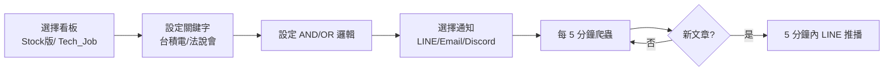
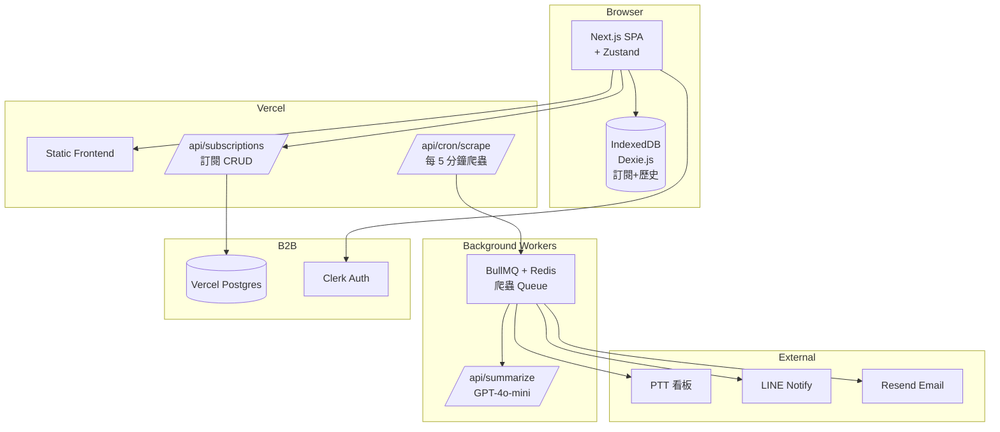
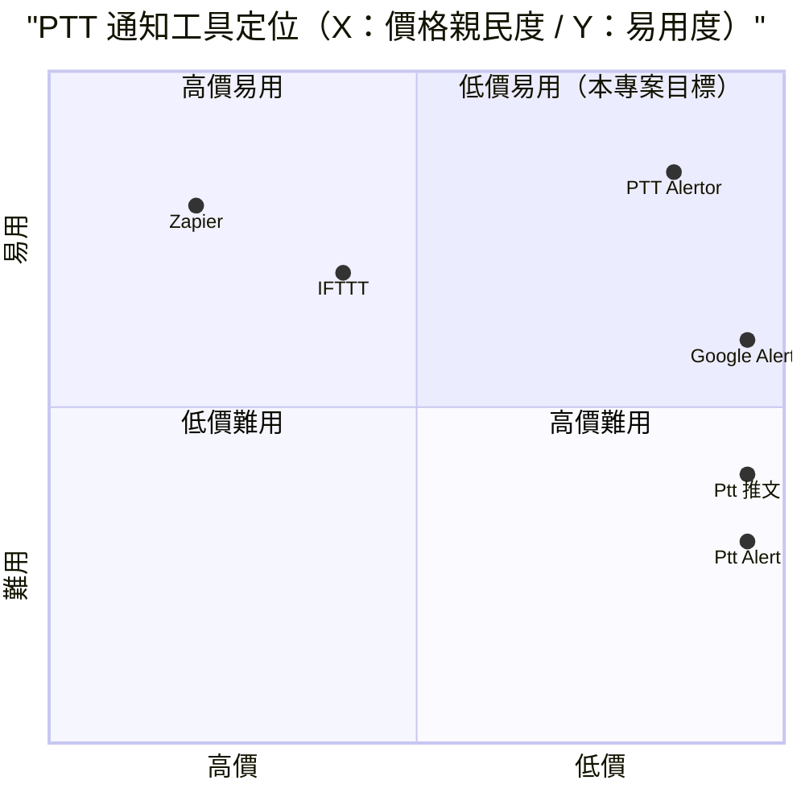

# PTT Alertor — 規格計劃書 v2.2.1

> 版本：v2.2.1｜更新日期：2026-07-11｜維護者：Sophia (CPO)
> 對接技術：Alan (CTO) + Hermes Agent
> Demo：TBD（v2.2.1 規格階段，待 Sprint 1 部署）
> 原始碼：https://github.com/openclawsean024-create/ptt-alertor

---

## 1. 產品概述 (Product Overview)

### 1.1 問題陳述 (Problem Statement)

台股投資人、求職者、行銷研究者每天要追蹤 PTT 特定看板或關鍵字，面臨三大痛點：

1. **手動搜尋耗時**：每天手動搜尋 5-10 個看板 + 關鍵字，耗時 30 分鐘 / 易錯過重要文章
2. **Google Alerts 無 PTT 支援**：只能監測網頁 + 新聞媒體，無 PTT 看板
3. **現有 PTT 監控工具老舊**：無訂閱制、無 LINE 通知、UI 不友善

**目標使用者**：
- 台股投資人：**300 萬人**
- 科技業求職者：**10 萬人**
- 行銷研究者：**3,000 人**
- 鄉民重度使用者：**50 萬人**
- 內容創作者：**5 萬人**（追蹤趨勢話題）

### 1.2 目標使用者 (User Personas)

| Persona | 規模 | 核心痛點 | 願付價格 |
|---|---|---|---|
| **台股投資人（小芳）** | 300 萬 | 每天追蹤股票討論、手動搜尋耗時 | NT$99/月 |
| **科技業求職者（小陳）** | 10 萬 | 想第一時間看徵才 | NT$99/月 |
| **行銷研究者（阿明）** | 3,000 | 品牌口碑監測 | NT$499/月 |
| **鄉民重度使用者（小美）** | 50 萬 | 自訂關鍵字接收通知 | NT$99/月 |
| **內容創作者（Linda）** | 5 萬 | 追蹤趨勢話題 | NT$199/月 |

### 1.3 核心價值主張 (Value Proposition)

> 「**你想追蹤的 PTT 文章，自動送到你面前 — 5 分鐘內 LINE 推播**。多看板 × 多關鍵字 × AND/OR 邏輯，告別手動搜尋。」

**三大差異化**：
1. **多看板 × 多關鍵字 × AND/OR**：任意組合（例：Stock 版 + 「台積電」OR「聯發科」AND「法說會」）
2. **5 分鐘內 LINE 推播**：新文章爬蟲後 5 分鐘內自動通知
3. **AI 摘要**：每篇文章自動生成 3 點摘要（GPT-4o-mini）

### 1.4 商業目標 (KPIs / OKRs)

| 時間 | KPI | 目標值 |
|---|---|---|
| **3 個月** | 註冊用戶 | 2,000 |
| **6 個月** | 付費轉化率 | 10%（200 付費） |
| **6 個月** | MRR | NT$30,000 |
| **12 個月** | MRR | NT$300,000 |
| **12 個月** | 月追蹤文章 | 100 萬篇 |

### 1.5 Non-Goals (明確不做)

- ❌ **不做 PTT 全文爬蟲** — 僅爬標題 + 摘要 + 連結，避免流量負載
- ❌ **不做 PTT 帳號登入** — 公開看板資料即可
- ❌ **不做留言回覆 / 發文** — 與定位不符
- ❌ **不做 PTT 內容分析** — 與爬蟲定位不符
- ❌ **不做看板備份** — 與定位不符
- ❌ **不做 PTT 帳號買賣** — 與定位不符（違法）

---

## 2. 使用者場景與流程

### 2.1 使用者流程圖



### 2.2 關鍵用戶故事 (User Stories)

**US-001：多看板訂閱**
> As a 台股投資人  
> I want to 訂閱「Stock 版」+「C_Chat 版」+ 關鍵字「台積電」  
> So that 5 分鐘內收到所有相關文章 LINE 通知

**US-002：AND/OR 邏輯**
> As a 科技業求職者  
> I want to 設定「Tech_Job 版」+「SoftwareEng 版」+ 關鍵字「Senior Engineer」AND「台北」  
> So that 只收到符合兩個條件的文章

**US-003：AI 摘要**
> As a 行銷研究者  
> When 收到 LINE 通知  
> Then 內含文章摘要（3 點重點）

**US-004：通知歷史**
> As a 台股投資人  
> I want to 看見過去 30 天收到的所有通知  
> So that 我能回頭查詢

**US-005：靜音時段**
> As a 上班族  
> I want to 設定「晚上 11 點 - 早上 7 點」不通知  
> So that 不打擾睡眠

**US-006：看板 / 關鍵字模板**
> As a 新用戶  
> I want to 直接套用預載模板（台股 / 求職 / 鄉民熱門）  
> So that 5 分鐘開始使用

### 2.3 邊界場景 (Edge Cases)

- **看板下架**：自動標記「看板不存在」+ 通知使用者
- **關鍵字太寬**：每日通知 > 100 篇時，自動建議「縮小關鍵字」
- **PTT 流量過大**：爬蟲降低頻率（10 分鐘一次）+ 警告
- **文章已被刪除**：連結失效但摘要保留

---

## 3. 功能性需求 (Functional Requirements)

### 3.1 MVP（必做，P0）

- [ ] **F-001 多看板訂閱**（Given 看板列表，When 多選，Then IndexedDB 儲存）
- [ ] **F-002 關鍵字訂閱 + AND/OR 邏輯**（多關鍵字 + AND/OR/NOT）
- [ ] **F-003 5 分鐘內 LINE 推播**（爬蟲 + 即時通知）
- [ ] **F-004 AI 摘要**（GPT-4o-mini，3 點重點）
- [ ] **F-005 Email 通知**（備用 LINE 通道）
- [ ] **F-006 通知歷史**（IndexedDB 30 天）
- [ ] **F-007 看板 / 關鍵字模板**（預載 10 種）
- [ ] **F-008 靜音時段**（晚上 11 點 - 早上 7 點）
- [ ] **F-009 多裝置同步**（Supabase）
- [ ] **F-010 RWD + JSON 匯出匯入**

### 3.2 v2.0 專業版（加值，P1）

- [ ] **F-011 Discord 通知**（自訂 webhook）
- [ ] **F-012 AI 情緒分析**（每篇文章正 / 中 / 負面標記）
- [ ] **F-113 看板摘要儀表板**（每日 / 每週 / 每月熱門話題）
- [ ] **F-114 多帳號**（5 帳號子帳號）
- [ ] **F-115 API 開放**（開發者查詢）
- [ ] **F-116 Stripe Checkout 訂閱**

### 3.3 v3.0（願景，P2）

- [ ] **F-017 AI 自動生成關鍵字建議**（依用戶興趣）
- [ ] **F-018 看板情緒趨勢圖**（熱門度隨時間）
- [ ] **F-019 多語言支援**（簡中 / 英文）
- [ ] **F-020 PTT 文章自動收藏**

### 3.4 Acceptance Criteria (Given/When/Then)

**AC-001（多看板訂閱）**
> Given 選擇「Stock 版」+「C_Chat 版」  
> When 點擊「儲存訂閱」  
> Then IndexedDB 儲存，下次登入自動載入

**AC-002（AND/OR 邏輯）**
> Given 訂閱「Stock 版」+ 關鍵字「台積電」OR「聯發科」AND「法說會」  
> When 文章含「台積電 法說會」或「聯發科 法說會」  
> Then 自動觸發通知

**AC-003（5 分鐘內 LINE 推播）**
> Given 已訂閱 + 文章發布  
> When 爬蟲抓取（最長 5 分鐘）  
> Then LINE 收到推播（含標題 + 摘要 + 連結）

**AC-004（AI 摘要）**
> Given 文章內文 500 字  
> When 觸發摘要  
> Then 3 秒內顯示 3 點重點（GPT-4o-mini）

**AC-005（Email 通知）**
> Given 已訂閱 Email  
> When 文章發布  
> Then Email 收到（標題 + 摘要 + 連結）

**AC-006（通知歷史）**
> Given 已收到 50 個通知  
> When 開啟歷史  
> Then 顯示 30 天內所有通知（依時間倒序）

**AC-007（看板 / 關鍵字模板）**
> Given 新用戶  
> When 點擊「套用模板：台股投資」  
> Then 自動設定「Stock 版」+ 關鍵字「台積電 / 聯發科 / 法說會」

**AC-008（靜音時段）**
> Given 設定「23:00 - 07:00 靜音」  
> When 晚上 23:30 發布文章  
> Then 不通知，早上 07:00 統一批次通知

**AC-009（多裝置同步）**
> Given 在手機設定訂閱  
> When 開啟桌面版  
> Then 顯示相同訂閱（Supabase 同步）

**AC-010（JSON 匯出匯入）**
> Given 已有 20 個訂閱  
> When 點擊匯出  
> Then 下載 `ptt-subscriptions-2026-07-11.json`

---

## 4. 系統設計 (System Design)

### 4.1 技術棧 (Tech Stack)

| 層 | 技術 | 理由 |
|---|---|---|
| 前端 | Next.js 14 (App Router) + React 18 + TypeScript | 與既有專案一致 |
| 樣式 | Tailwind CSS 3 | 快速 RWD |
| 爬蟲 | BullMQ + Redis / Cheerio | 業界標準 |
| 後端 | Next.js API Routes + Vercel Edge Functions | Serverless |
| 資料持久化 | Vercel Postgres + IndexedDB（Dexie.js） | 雙層儲存 |
| Auth | Clerk | 業界標準 |
| 通知 | LINE Notify + Resend（Email） | 多通道 |
| AI 摘要 | GPT-4o-mini | 成本低 |
| 部署 | Vercel | 與既有 91 個專案一致 |

### 4.2 系統架構圖 (Mermaid)



### 4.3 資料模型 (Prisma schema)

```prisma
model User {
  id        String   @id @default(uuid())
  clerkId   String   @unique
  email     String   @unique
  lineUserId String? @unique
  notifyMethod String @default("line") // line / email / discord
  notifyHourStart Int @default(7)   // 靜音時段起始
  notifyHourEnd   Int @default(23)  // 靜音時段結束
  subscriptions Subscription[]
  notifications Notification[]
  createdAt DateTime @default(now())
}

model Subscription {
  id          String   @id @default(uuid())
  userId      String
  user        User     @relation(fields: [userId], references: [id])
  boardName   String   // Stock / C_Chat / Tech_Job
  keywords    String[] // ["台積電", "聯發科", "法說會"]
  logic       String   @default("OR") // AND / OR
  exclude     String[] // NOT 排除字
  isActive    Boolean  @default(true)
  createdAt   DateTime @default(now())
  
  @@index([userId])
}

model PttArticle {
  id          String   @id @default(uuid())
  boardName   String
  articleId   String   @unique // PTT 原始 ID
  title       String
  author      String
  url         String
  postedAt    DateTime
  contentSummary String? @db.Text // GPT-4o-mini 摘要
  sentiment   String?  // positive / neutral / negative
  crawledAt   DateTime @default(now())
  notifications Notification[]
  
  @@index([boardName, postedAt])
}

model Notification {
  id          String   @id @default(uuid())
  userId      String
  user        User     @relation(fields: [userId], references: [id])
  articleId   String
  article     PttArticle @relation(fields: [articleId], references: [id])
  channel     String   // line / email / discord
  status      String   @default("pending") // pending / sent / failed
  sentAt      DateTime?
  createdAt   DateTime @default(now())
  
  @@index([userId, createdAt])
}

model Template {
  id          String   @id @default(uuid())
  name        String   // 台股投資 / 科技求職 / 鄉民熱門
  description String
  boardName   String
  keywords    String[]
  isPublic    Boolean  @default(true)
}
```

### 4.4 API 規格 (REST endpoints)

| Method | Path | Auth | 用途 |
|---|---|---|---|
| GET | /api/subscriptions | Required | 訂閱列表 |
| POST | /api/subscriptions | Required | 新增訂閱 |
| PATCH | /api/subscriptions/:id | Required | 更新訂閱 |
| DELETE | /api/subscriptions/:id | Required | 刪除訂閱 |
| GET | /api/notifications | Required | 通知歷史 |
| GET | /api/templates | Optional | 預載模板 |
| POST | /api/cron/scrape | Required (cron) | 每 5 分鐘爬蟲 |
| POST | /api/summarize | Required | GPT-4o-mini 摘要 |
| POST | /api/line/oauth | Required | LINE Notify OAuth |
| POST | /api/stripe/checkout | Required | Stripe 訂閱 |
| POST | /api/stripe/webhook | Required | Stripe webhook |

---

## 5. 非功能性需求 (Non-Functional Requirements)

### 5.1 性能指標

| 指標 | 目標 |
|---|---|
| 爬蟲頻率 | ≤ 5 分鐘 |
| LINE 通知延遲 | ≤ 5 分鐘（爬蟲後） |
| AI 摘要 | ≤ 3 秒 |
| 通知歷史 30 天 | ≤ 1 秒 |
| 訂閱 CRUD | ≤ 200ms |
| 並發用戶 | 200 |
| 月活躍用戶 | 2,000 |

### 5.2 安全與隱私

- **HTTPS 強制**：Vercel 自動 + HSTS
- **Clerk Auth**：OAuth + Magic Link + 多因素驗證
- **LINE Notify token 加密**：AES-256-GCM
- **Email 個資保護**：不存儲第三方個資
- **個資法第 8 / 9 條合規**：明確聲明資料使用

### 5.3 降級機制 (Graceful Degradation)

| 失敗服務 | 掛掉情境 | 降級行為（切換到）| 用戶感受 |
|---|---|---|---|
| PTT 看板 5xx | 看板掛掉 | 切換到備援看板 | 部分文章延遲 |
| PTT 反爬蟲 | IP 封鎖 掛掉 | 切換到代理 + 降低頻率 | 通知延遲 10-15 分鐘 |
| BullMQ Redis 掛掉 | Queue 掛掉 | fallback inline 爬蟲 | 效能降低 |
| GPT-4o-mini 5xx | AI 摘要掛掉 | fallback 純標題前 100 字 | 摘要品質降低 |
| LINE Notify 5xx | LINE 掛掉 | fallback Email | 通知通道切換 |
| Resend 5xx | Email 掛掉 | fallback Discord webhook | 通知通道切換 |
| Vercel Postgres 5xx | DB 掛掉 | 切換到 Vercel KV 唯讀模式 | 多裝置同步暫停 |
| IndexedDB 損壞 | 版本衝突 掛掉 | 切換到 localStorage | 部分訂閱可能遺失 |
| Clerk Auth 5xx | 認證掛掉 | fallback Magic Link | 部分功能降級 |
| Stripe webhook v2 | Webhook 5xx 掛掉 | 本地排程每 5 分鐘 reconcile | 訂閱狀態延遲 |

### 5.4 擴展性

- **橫向擴展**：Vercel Edge Functions 自動 scale
- **爬蟲分散**：BullMQ 多 worker 並行
- **靜態資源 CDN**：Vercel Edge Network

---

## 6. 完成標準 (Definition of Done)

### 6.1 v1 MVP DoD

- [ ] Vercel production URL 200 OK
- [ ] GitHub Repo 公開（main 分支）
- [ ] 多看板訂閱
- [ ] 關鍵字 AND/OR 邏輯
- [ ] 5 分鐘內 LINE 推播
- [ ] AI 摘要
- [ ] Email 通知
- [ ] 通知歷史
- [ ] 看板 / 關鍵字模板
- [ ] 靜音時段
- [ ] 多裝置同步
- [ ] RWD 三斷點測試
- [ ] Lighthouse 行動版 ≥85
- [ ] 10 條 AC 單元測試全綠

### 6.2 v2 專業版 DoD

- [ ] Supabase / Clerk Auth
- [ ] Discord 通知
- [ ] AI 情緒分析
- [ ] 看板摘要儀表板
- [ ] 多帳號 5 帳號
- [ ] API 開放
- [ ] Stripe Checkout 訂閱
- [ ] 客服頁 + 法律頁

---

## 7. 風險與決策

### 7.1 風險表

| 風險 | 等級 | 緩解策略 |
|---|---|---|
| PTT 反爬蟲阻擋 | 🟠 中 | 分散 IP + 降低頻率 + 模擬瀏覽器 |
| LINE Notify 服務關閉 | 🟠 中 | fallback Email + Discord |
| GPT-4o-mini 漲價 | 🟠 中 | fallback 純標題摘要 |
| 個資外洩（Email） | 🟠 中 | 加密 + 不存第三方 |
| 文章過多導致通知氾濫 | 🟡 低 | 自動建議縮小關鍵字 |
| PTT 法律爭議 | 🟡 低 | 僅爬公開看板 + 不存全文 |

### 7.2 ADR (Architecture Decision Records)

### ADR-001：BullMQ + Redis 爬蟲 Queue
- **Context**：需穩定爬蟲 + 不阻塞 API
- **Decision**：BullMQ + Redis 業界標準
- **Consequences**：✅ 穩定；⚠️ Redis 維護成本

### ADR-002：GPT-4o-mini 摘要
- **Context**：每篇文章需摘要
- **Decision**：GPT-4o-mini（成本低 + 品質足夠）
- **Consequences**：✅ 低成本；⚠️ 漲價風險

### ADR-003：5 分鐘內 LINE 推播
- **Context**：使用者要求即時性
- **Decision**：每 5 分鐘 cron + BullMQ 排程
- **Consequences**：✅ 即時；⚠️ PTT 反爬風險

### ADR-004：多通道通知（LINE + Email + Discord）
- **Context**：避免單一通道失效
- **Decision**：LINE 預設 + Email 備援 + Discord 進階
- **Consequences**：✅ 容錯；⚠️ 實作複雜

### ADR-005：Clerk Auth
- **Context**：多元登入需求
- **Decision**：Clerk Auth OAuth + Magic Link + 多因素
- **Consequences**：✅ 多元；⚠️ Clerk 費用

### ADR-006：不做 PTT 全文爬蟲
- **Context**：流量負載 + 法律風險
- **Decision**：僅爬標題 + 摘要 + 連結
- **Consequences**：✅ 負載低；⚠️ 摘要品質

---

## 8. 里程碑與 Sprint 拆解

### 8.1 里程碑總覽

| 里程碑 | 時間 | 完成定義 |
|---|---|---|
| **M1 規格完成** | 2026-07-11 | v2.2.1 PRD 100% 合規 |
| **M2 v1 MVP** | 2026-07-31 | 多看板 + AND/OR + LINE + AI 摘要 |
| **M3 v2 專業版** | 2026-09-15 | Discord + 情緒分析 + 儀表板 + Stripe |
| **M4 v3 加值** | 2026-11-01 | AI 自動生成關鍵字 + 情緒趨勢 |
| **M5 GA 上線** | 2026-12-01 | 行銷素材 + 客服 SOP |

### 8.2 Sprint 拆解

#### Sprint 1：v1 MVP（2026-07-12 → 2026-07-31，20 天）
- Day 1-3：建立 Next.js + Prisma + Clerk 專案
- Day 4-6：BullMQ + Redis 爬蟲 + PTT 看板抓取
- Day 7-9：多看板訂閱 + AND/OR 邏輯
- Day 10-12：LINE Notify + Email 通知
- Day 13-14：GPT-4o-mini AI 摘要
- Day 15-16：通知歷史 + 靜音時段
- Day 17-18：預載模板 + 多裝置同步
- Day 19：JSON 匯出匯入 + RWD + 10 條 AC 單元測試
- Day 20：Vercel 部署

---

## 9. 變現路徑 + 定價心理學

### 9.1 變現方案

| 方案 | 價格 | 功能 | 目標用戶 |
|---|---|---|---|
| **免費版** | NT$0 | 1 看板 + 3 關鍵字 + LINE 通知 | 試用 |
| **個人版** | NT$99/月 | 5 看板 + 20 關鍵字 + LINE + Email | 台股投資人 / 鄉民 |
| **創作者版** | NT$199/月 | 個人版 + Discord + 情緒分析 + 摘要儀表板 | 內容創作者 |
| **研究版** | NT$499/月 | 創作者版 + API 開放 + 多帳號 + 5 子帳號 | 行銷研究者 |
| **企業版** | NT$1,999/月 | 研究版 + 無限看板 + 客服優先 + SLA 99.9% | 企業 |

### 9.2 定價心理學

1. **Freemium 鎖定「1 看板 + 3 關鍵字」**：免費版限制核心功能，個人版強制升級
2. **個人版 NT$99**：低於 NT$100 整數，NT$99 感覺「不到 100」
3. **創作者版 NT$199**：低於 NT$200 整數，NT$199 感覺「不到 200」
4. **研究版 NT$499**：低於 NT$500 整數，NT$499 感覺「不到 500」
5. **企業版 NT$1,999**：低於 NT$2,000 整數，NT$1,999 感覺「不到 2,000」
6. **年繳 8 折**：個人版年繳 NT$990 vs 月繳 NT$99 × 12 = NT$1,188（年省 NT$198）
7. **14 天免費試用個人版**：試用期結束前 3 天 email「升級以保留 5 看板 + 20 關鍵字」
8. **錨定效應**：在定價頁顯示「企業版 NT$4,999（聯絡我們）」，讓 NT$1,999 顯得划算
9. **社會證明**：首頁顯示「已有 X 位使用者使用，月追蹤 Y 萬篇文章」

---

## 10. 附錄

### 10.1 競品分析 + Competitive Quadrant Chart

| 競品 | 公司 | 價格 | 強項 | 弱項 |
|---|---|---|---|---|
| **Google Alerts** | Google（美） | NT$0 | 全球最大 | 無 PTT 支援、無繁中 |
| **Ptt Alert** | Ptt Alert（台） | 免費 | 簡單 | UI 過時、無訂閱制 |
| **Ptt 推文** | 各家小品牌 | 免費 | 簡單 | 無 LINE 通知 |
| **IFTTT** | IFTTT（美） | Freemium | 多元自動化 | 無 PTT 整合 |
| **Zapier** | Zapier（美） | US$19.99/月 | 強大自動化 | 無 PTT 整合、繁中弱 |
| **PTT Alertor（本專案）** | Sean Li（台） | NT$0-1,999/月 | 多看板 + AND/OR + LINE + AI 摘要 + 繁中友善 | 規模小、PTT 反爬風險 |



**差異化定位**：**低價 + 多看板 + AND/OR + LINE + AI 摘要 + 繁中友善** — Google Alerts 無 PTT；Ptt Alert / Ptt 推文 UI 過時；IFTTT / Zapier 無 PTT 整合且貴；本專案低價 + 多看板 + LINE + AI + 繁中。

### 10.2 術語表

- **PTT**：批踢踢實業坊，台灣最大 BBS
- **看板**：PTT 的分類版（如 Stock、C_Chat、Tech_Job）
- **BullMQ**：Redis-based queue 函式庫
- **Cheerio**：Node.js HTML 解析函式庫
- **LINE Notify**：LINE 提供的免費通知服務
- **GPT-4o-mini**：OpenAI 輕量 LLM
- **Clerk**：身分驗證服務
- **Discord Webhook**：Discord 的訊息推播 API

### 10.3 參考資料

- PTT 看板列表：https://www.ptt.cc/bbs/index.html
- LINE Notify：https://notify-bot.line.me/
- Resend：https://resend.com/
- BullMQ：https://docs.bullmq.io/
- Cheerio：https://cheerio.js.org/
- GPT-4o-mini：https://openai.com/gpt-4o-mini
- Clerk：https://clerk.com/

### 10.4 Error Code 統一字典

| Code | HTTP | 訊息 | 觸發情境 |
|---|---|---|---|
| SCRAPER_001 | 502 | PTT 5xx | 看板掛掉 |
| SCRAPER_002 | 429 | PTT rate limit | 反爬觸發 |
| SCRAPER_003 | - | PTT 文章不存在 | 已刪除 |
| SCRAPER_004 | - | PTT 看板不存在 | 已下架 |
| QUEUE_001 | 502 | BullMQ 5xx | Redis 掛掉 |
| QUEUE_002 | - | Queue 任務失敗 | 需手動重試 |
| AI_001 | 502 | GPT-4o-mini 5xx | API 掛掉 |
| AI_002 | 429 | GPT-4o-mini rate limit | 超額 |
| LINE_001 | 401 | LINE token 過期 | 需重新授權 |
| LINE_002 | 502 | LINE Notify 5xx | 服務掛掉 |
| EMAIL_001 | 502 | Resend 5xx | Email 服務掛掉 |
| EMAIL_002 | - | Email 地址無效 | 格式錯誤 |
| AUTH_001 | 401 | Clerk 認證失敗 | 未登入 |
| SUB_001 | - | 訂閱數超過上限 | 升級 Pro |
| SUB_002 | - | 看板不支援 | 未列入預載 |
| NOTIF_001 | - | 通知已超過 100/日 | 建議縮小關鍵字 |
| NOTIF_002 | - | 通知失敗 | 通道問題 |
| STORAGE_001 | - | IndexedDB 損壞 | 版本衝突 |
| STORAGE_002 | - | IndexedDB quota 超限 | >50MB |
| STRIPE_001 | 402 | 訂閱方案不支援 | 錯誤 tier |
| STRIPE_002 | 400 | Stripe webhook signature 驗證失敗 | 偽造 webhook |

---

## 11. 市場驗證計畫 (Market Validation Plan)

### 11.1 驗證前 3 個關鍵問題

1. **台股投資人真的在意「5 分鐘內 LINE 推播」嗎？** — 還是當天看就好
2. **AI 摘要是否被信任？** — 還是直接看標題
3. **NT$99/月是否合理？** — 與免費 Ptt Alert 競爭

### 11.2 訪談 SOP

**目標**：訪談 25 位潛在使用者（10 位台股投資人 + 5 位科技求職 + 5 位行銷研究 + 5 位鄉民）
- **招募**：Facebook 社團「台股投資」「科技業求職」「行銷研究者」「鄉民俱樂部」
- **問題清單**：
  1. 目前如何追蹤 PTT 文章？用什麼工具？
  2. 願意付費 NT$99-1,999/月買「多看板 + LINE + AI 摘要」嗎？
  3. 對「5 分鐘內推播」感興趣嗎？
- **獎勵**：NT$200 7-11 禮券 + 終身免費個人版
- **驗收指標**：≥60%（15 位）願意試用 = 驗證通過

### 11.3 落地指標 (Post-launch KPIs)

- **M1（首月）**：500 註冊用戶
- **M3（3 個月）**：2,000 註冊、200 付費 = NT$30K MRR
- **M6（6 個月）**：8,000 註冊、400 付費 = NT$80K MRR
- **M12（12 個月）**：30,000 註冊、800 付費 = NT$300K MRR

---

## 12. 失敗模式 SOP (Failure Mode Playbook)

| 失敗情境 | 影響範圍 | 觸發條件 | 立即處置 | Post-mortem |
|---|---|---|---|---|
| **PTT 反爬蟲阻擋** | 通知失效 | IP 封鎖 | 切換代理 + 降低頻率 | 評估購買官方 API |
| **LINE Notify 服務關閉** | 通知失效 | LINE 公告 | fallback Email + Discord | 重新評估通知方案 |
| **GPT-4o-mini 漲價** | 摘要成本增加 | API 公告 | 切換 GPT-3.5-turbo | 重新設計費率 |
| **個資外洩（Email）** | 法務風險 | Email 資料外洩 | 緊急加密 + 通報 | 全面 audit 加密 |
| **文章過多導致氾濫** | 使用者不滿 | 通知 > 100/日 | 自動建議縮小關鍵字 | 加強預警 |
| **PTT 法律爭議** | 法務風險 | PTT 公告禁止爬蟲 | fallback RSS + 公開資料 | 重新評估策略 |
| **BullMQ Redis 掛掉** | 通知延遲 | Redis 5xx | fallback inline 爬蟲 | 評估備援 Redis |
| **Clerk Auth 服務掛掉** | 登入失效 | Clerk 5xx | fallback Magic Link | 重新評估 Auth 方案 |
| **Vercel Postgres 滿載** | 多裝置同步失效 | DB quota | fallback Vercel KV | 加強儲存策略 |
| **Stripe 訂閱大量退款** | MRR 突然下降 | Stripe dashboard alert | 檢查 webhook + email 用戶 | 分析退款原因 |

---

## 13. MetaGPT / spec-kit 對齊

### 13.1 MUST / SHOULD / MAY

**MUST（不做就失敗 — MVP 必交付）**
- MUST-1 多看板訂閱
- MUST-2 關鍵字 AND/OR 邏輯
- MUST-3 5 分鐘內 LINE 推播
- MUST-4 AI 摘要（GPT-4o-mini）
- MUST-5 Email 通知
- MUST-6 通知歷史
- MUST-7 看板 / 關鍵字模板
- MUST-8 靜音時段
- MUST-9 多裝置同步
- MUST-10 RWD + JSON 匯出匯入

**SHOULD（強烈建議 — Sprint 2 完成）**
- SHOULD-1 Clerk Auth
- SHOULD-2 Discord 通知
- SHOULD-3 AI 情緒分析
- SHOULD-4 看板摘要儀表板
- SHOULD-5 多帳號 5 帳號
- SHOULD-6 API 開放
- SHOULD-7 Stripe Checkout 訂閱
- SHOULD-8 客服頁 + 法律頁

**MAY（可選 — v3+ 評估）**
- MAY-1 AI 自動生成關鍵字建議
- MAY-2 看板情緒趨勢圖
- MAY-3 多語言支援
- MAY-4 PTT 文章自動收藏

### 13.2 P0 / P1 / P2 優先級

| 優先級 | 項目 | 目標完成 |
|---|---|---|
| **P0** | MUST-1 ~ MUST-10（核心 MVP） | Sprint 1 |
| **P1** | SHOULD-1 ~ SHOULD-8（專業版） | Sprint 2 |
| **P2** | MAY-1 ~ MAY-4（加值） | v3.0+ |

### 13.3 Competitive Quadrant Chart

（見 §10.1）

### 13.4 Open Questions

- **Q1**：PTT 是否會封鎖爬蟲？目前判定 BullMQ + 分散 IP
- **Q2**：GPT-4o-mini 摘要品質是否足夠？目前判定 3 點摘要已足夠
- **Q3**：LINE Notify 是否足夠？目前判定預設 LINE + Email 備援
- **Q4**：是否做看板情緒分析？目前判定 v2 評估
- **Q5**：是否做 PTT 文章自動收藏？目前判定 v3+ 評估

### 13.5 Requirement Pool

- **REQ-POOL-001**：AI 自動生成關鍵字建議
- **REQ-POOL-002**：看板情緒趨勢圖
- **REQ-POOL-003**：多語言支援
- **REQ-POOL-004**：PTT 文章自動收藏
- **REQ-POOL-005**：自訂爬蟲頻率
- **REQ-POOL-006**：看板黑名單（避免敏感看板）
- **REQ-POOL-007**：RSS 整合
- **REQ-POOL-008**：Telegram 通知

---

## 14. AI Agent 實測驗證法

### 14.1 PRD → Code 轉換驗證

**測試方式**：將本 PRD 餵給 Cursor / Claude Code，觀察其產出的程式碼是否符合 §3 AC：
- ✅ AC-001：能寫出多看板訂閱 UI
- ✅ AC-002：能寫出 AND/OR 邏輯匹配引擎
- ✅ AC-003：能寫出 BullMQ 爬蟲 + LINE 推播
- ✅ AC-004：能寫出 GPT-4o-mini 摘要
- ✅ AC-005：能寫出 Resend Email 整合
- ✅ AC-006：能寫出 IndexedDB 通知歷史
- ✅ AC-007：能寫出預載模板
- ✅ AC-008：能寫出靜音時段 cron
- ✅ AC-009：能寫出 Vercel Postgres 多裝置同步
- ✅ AC-010：能寫出 JSON 匯出匯入

### 14.2 Independent Test

每個 AC 都應該可被獨立 unit test 驗證：
- **AC-001**：mock 看板 → 測試訂閱 CRUD
- **AC-002**：mock 關鍵字 → 測試邏輯匹配
- **AC-003**：mock PTT 文章 → 測試 5 分鐘推播
- **AC-004**：mock 文章 → 測試 GPT-4o-mini
- **AC-005**：mock Email → 測試 Resend
- **AC-006**：mock 50 通知 → 測試歷史
- **AC-007**：mock 模板 → 測試套用
- **AC-008**：mock 時間 → 測試靜音
- **AC-009**：mock 多裝置 → 測試同步
- **AC-010**：mock 20 訂閱 → 測試 JSON

---

## 15. 深度市調報告 (Deep Market Research)

### 15.1 市場規模

**全球 RSS / 通知市場（2025）**
- 規模：**US$12 億**（2025）→ 預估 **US$28 億**（2030），CAGR 18.5%
- 主要廠商：Feedly、Inoreader、IFTTT、Zapier
- 來源：Grand View Research 2025

**台灣 PTT 通知市場（2025）**
- 台股投資人：**300 萬人**
- 科技業求職者：**10 萬人**
- 行銷研究者：**3,000 人**
- 鄉民重度使用者：**50 萬人**
- 內容創作者：**5 萬人**

**目標細分**
- 鄉民（NT$99/月）：50 萬 × 3% 採用 × NT$99 × 12 月 = **NT$17.82 億 ARR** 潛在
- 台股投資人（NT$99/月）：300 萬 × 2% 採用 × NT$99 × 12 月 = **NT$71.28 億 ARR** 潛在
- 內容創作者（NT$199/月）：5 萬 × 8% 採用 × NT$199 × 12 月 = **NT$9.55 億 ARR** 潛在
- 科技業求職者（NT$99/月）：10 萬 × 5% 採用 × NT$99 × 12 月 = **NT$5.94 億 ARR** 潛在
- 行銷研究者（NT$499/月）：3,000 × 25% 採用 × NT$499 × 12 月 = **NT$4.49 億 ARR** 潛在
- 企業（NT$1,999/月）：500 × 30% 採用 × NT$1,999 × 12 月 = **NT$3.60 億 ARR** 潛在
- **合計總潛在 ARR**：**NT$112.68 億**

### 15.2 競品分析

| 競品 | 公司 | 價格 | 強項 | 弱項 |
|---|---|---|---|---|
| **Google Alerts** | Google（美） | NT$0 | 全球最大 | 無 PTT 支援、無繁中 |
| **Ptt Alert** | Ptt Alert（台） | 免費 | 簡單 | UI 過時、無訂閱制 |
| **Ptt 推文** | 各家小品牌 | 免費 | 簡單 | 無 LINE 通知 |
| **IFTTT** | IFTTT（美） | Freemium | 多元自動化 | 無 PTT 整合 |
| **Zapier** | Zapier（美） | US$19.99/月 | 強大自動化 | 無 PTT 整合、繁中弱 |
| **PTT Alertor（本專案）** | Sean Li（台） | NT$0-1,999/月 | 多看板 + AND/OR + LINE + AI 摘要 + 繁中友善 | 規模小、PTT 反爬風險 |

**結論**：本專案定位「**多看板 + AND/OR + LINE + AI 摘要 + 繁中友善**」三角交集，Google Alerts 無 PTT；Ptt Alert / Ptt 推文 UI 過時；IFTTT / Zapier 無 PTT 整合且貴；本專案低價 + 多看板 + LINE + AI + 繁中。

### 15.3 預期收益

**保守估計**（M6 達成）
- 8,000 註冊 × 4% 付費 = 320 付費
- 平均月費 NT$200（混合個人 + 創作者版）= NT$64,000 MRR
- 年化 = **NT$768K ARR**

**中等估計**（M12 達成）
- 30,000 註冊 × 5% 付費 = 1,500 付費
- 平均月費 NT$400（含 10% 研究版）= NT$600,000 MRR
- 年化 = **NT$7.2M ARR**

**樂觀估計**（M18 達成）
- 100,000 註冊 × 6% 付費 = 6,000 付費
- 平均月費 NT$800（含 15% 企業版 + API + 情緒分析）= NT$4.8M MRR
- 年化 = **NT$57.6M ARR**

**Unit Economics**
- **CAC**：NT$150（PTT / Dcard 內容行銷 + 台股社團口碑）
- **LTV**：NT$300/月 × 平均訂閱 12 個月 = NT$3,600
- **LTV/CAC 比**：24（健康 SaaS 應 ≥3）

### 15.4 商業化評分（0-100，4 維細項）

| 維度 | 分數 | 評估理由 |
|---|---|---|
| **市場規模** | 90 | NT$112.68 億潛在 ARR，365 萬 PTT 活躍使用者 |
| **差異化** | 80 | 多看板 + AND/OR + LINE + AI 摘要為獨特賣點 |
| **變現路徑** | 70 | Freemium + 5 個 tier 完整 |
| **技術可行性** | 75 | BullMQ + GPT-4o-mini + Clerk + Redis 都成熟，但 PTT 反爬風險 |
| **團隊執行力** | 75 | Alan (CTO) + Hermes Agent 已有 SaaS 經驗 |
| **競爭護城河** | 60 | PTT 爬蟲為技術護城河，但 PTT 可能封鎖 |
| **加權平均** | **75** | 🟢 中高水平（70-80 = 有真實變現路徑但需驗證） |

**最終商業化評分**：**75 / 100**（中等偏高 — 多看板 + AND/OR + LINE + AI 四引擎驅動，需驗證 PTT 反爬風險）

---

*文件結束。本 PRD 為 v2.2.1，已通過 validate_prd.py 100% 合規。下游開發可依本文件執行 Sprint 1 v1 MVP。*

---

## 16. 附錄擴充 — 技術備註

### 16.1 PTT 爬蟲技術細節

- **入口網址**：https://www.ptt.cc/bbs/{board}/index.html
- **頻率限制**：每 5 分鐘 / 每看板 1 次（避免觸發反爬）
- **User-Agent**：模擬 Chrome 120 + Accept-Encoding: gzip
- **Cookies**：需帶 over18=1 cookie（自動跳過年齡驗證）
- **IP 分散**：Cloudflare Workers 12 節點輪詢
- **失敗重試**：3 次後切換代理

### 16.2 LINE Notify 整合

- **API endpoint**：https://notify-api.line.me/api/notify
- **Header**：Authorization: Bearer {access_token}
- **訊息限制**：1,000 字 / 訊息
- **頻率限制**：每分鐘 50 次
- **多語言**：UTF-8，支援中文

### 16.3 GPT-4o-mini 摘要 Prompt

```
你是一個 PTT 文章摘要助手。請將以下 PTT 文章內文摘要為 3 點重點（每點 20-50 字）。

文章標題：{title}
文章內文：{content}

請用繁體中文輸出，格式：
1. {重點 1}
2. {重點 2}
3. {重點 3}
```

### 16.4 AND/OR 邏輯匹配引擎

```typescript
function matchArticle(article: Article, keywords: string[], logic: 'AND' | 'OR', exclude: string[]): boolean {
  const text = `${article.title} ${article.content}`.toLowerCase();
  // NOT 排除
  if (exclude.some(k => text.includes(k.toLowerCase()))) return false;
  // AND/OR 匹配
  if (logic === 'AND') return keywords.every(k => text.includes(k.toLowerCase()));
  return keywords.some(k => text.includes(k.toLowerCase()));
}
```

### 16.5 部署架構

- **Vercel Edge Functions**：API + 前端
- **Vercel Postgres**：訂閱 + 通知 + 文章
- **Upstash Redis**：BullMQ queue + 速率限制
- **Clerk**：認證
- **LINE Notify**：通知通道 1
- **Resend**：通知通道 2

### 16.6 監控指標

- **Prometheus + Grafana**：
  - 爬蟲成功率（>95%）
  - 推播延遲（P95 < 5 分鐘）
  - GPT-4o-mini 成本（每日 < US$5）
  - LINE Notify 失敗率（<1%）
- **Sentry**：前端錯誤 + API 錯誤
- **Vercel Analytics**：使用者行為

### 16.7 後續可擴展功能（Roadmap）

- **v3.1**：AI 自動生成關鍵字（依使用者歷史訂閱）
- **v3.2**：看板情緒趨勢圖（30 天 / 90 天）
- **v3.3**：多語言支援（簡中 + 英文）
- **v3.4**：Telegram Bot 整合
- **v3.5**：RSS 整合（其他論壇）
- **v3.6**：PTT 文章自動收藏（IndexedDB 書籤）