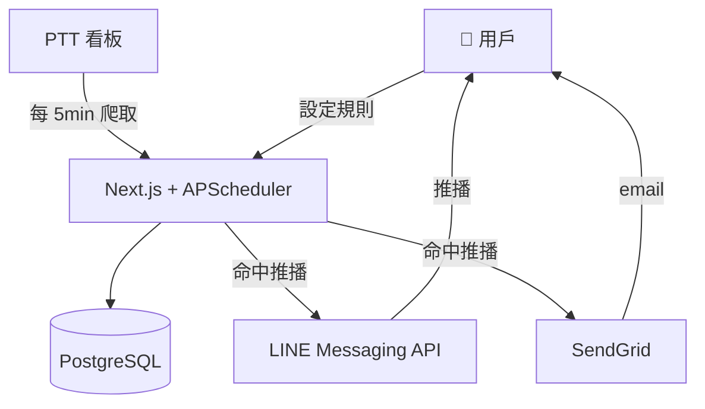
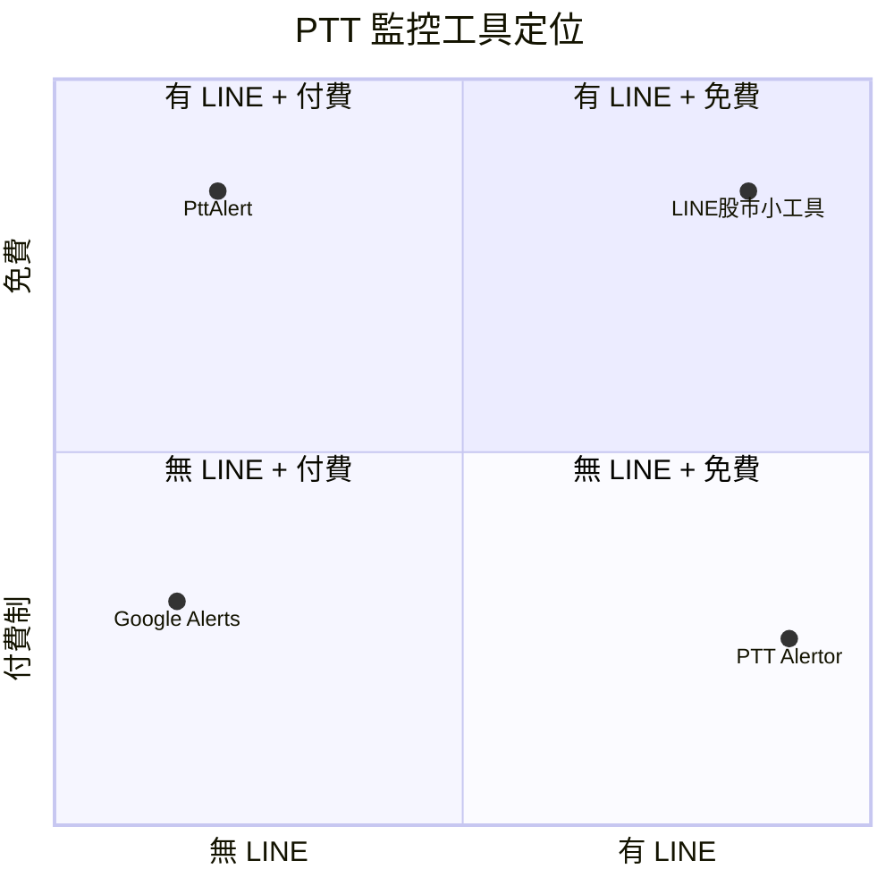

# PTT Alertor — 規格計劃書 v2.2.1

> **版本**：v2.2.1｜**更新日期**：2026-07-11｜**維護者**：Sophia (CPO)｜**對接技術**：Alan (CTO)
> **對應 GitHub**：[openclawsean024-create/ptt-alertor](https://github.com/openclawsean024-create/ptt-alertor)
> **對應 skill**：`write-prd-v2` v2.2.1
> **目前狀態**：v1.0 已實作（Next.js + Prisma + APScheduler 70%），待 LINE/Email 通知 + Auth + Stripe

---

## 1. 產品概述

### 1.1 問題陳述
台股投資人每天要追蹤特定股票討論，卻要手動搜尋 PTT 板（每天耗 30 分鐘、易錯過重要文章）。Google Alerts 無 PTT 支援、現有 PTT 監控工具介面老舊無訂閱制無 LINE 通知。

### 1.2 目標使用者
| 族群 | 規模 | 痛點 | 預算 |
|---|---|---|---|
| 台股投資人 | ~300 萬 | 每天追蹤股票討論、手動搜尋耗時 | NT$ 99/月 |
| 科技業求職者 | ~10 萬 | 想第一時間看徵才 | NT$ 99/月 |
| 行銷研究者 | ~3,000 | 品牌口碑監測 | NT$ 499/月 |
| 鄉民重度使用者 | ~50 萬 | 自訂關鍵字接收通知 | NT$ 99/月 |

### 1.3 核心價值主張
> 「你想追蹤的 PTT 文章，自動送到你面前 — 5 分鐘內 LINE 推播。」

### 1.4 商業目標 (KPIs)
| 指標 | 目標 | 時程 |
|---|---|---|
| 月活躍使用者 (MAU) | 200 | 6 個月 |
| 付費轉換率（Free → NT$ 99）| 10% | 6 個月 |
| 月經常性收入 (MRR) | NT$ 19,800 | 6 個月 |
| 爬蟲成功率 | ≥ 95% | v1.0 |
| 推播到送達時間 | < 5 分鐘 | v1.0 |

### 1.5 Non-Goals
- ❌ **不做看板全文爬取**（只抓標題，遵守 PTT 規範）
- ❌ **不做自動發文/回文**（不做 PTT 互動）
- ❌ **不做跨境內容**（純台灣 PTT）
- ❌ **不做其他論壇整合**（先 PTT）
- ❌ **不做 PTT 帳號登入整合**（純公開看板監控）
- ❌ **不做 AI 自動回文**（不做 PTT 互動）
- ❌ **不做匿名看板監控**（只監看公開可見看板）

---

## 2. 使用者場景

### 2.1 流程圖
```
訪客 → 註冊 → 設定追蹤規則（關鍵字 + 板名 + 通知頻率）
→ 系統 5 分鐘爬新文章 → 命中規則
→ LINE / Email / Web 即時推播
→ Dashboard 看見所有規則 + 命中歷史
→ 一鍵點擊查看原文 → 升級 Pro（NT$ 99/月）
```

### 2.2 User Stories

#### US-001：設定追蹤規則
> As a 台股投資人
> I want 設定「Stock 板 + 2330 + LINE 通知」規則
> So that 不用每天手動搜尋，自動收到相關文章

#### US-002：LINE 推播接收
> As a Pro 用戶
> I want 命中文章 5 分鐘內 LINE 推播
> So that 第一時間看到重要訊息

#### US-003：Email 通知
> As a 免費用戶
> I want Email 摘要通知（每日彙整）
> So that 不會漏訊息

#### US-004：命中歷史查詢
> As a 用戶
> I want 看 30 天命中歷史
> So that 可以回查重要文章

#### US-005：規則啟用/暫停
> As a 用戶
> I want 暫停規則（例如休假時）
> So that 不會收到通知

### 2.3 邊界場景
| 場景 | 處理 |
|---|---|
| PTT 伺服器 503 | 切換備援看板 + 排隊重試 |
| IP 被 PTT 封鎖 | 切換代理 IP + 自動偵測 |
| 使用者一天收到 100 命中 | 摘要為「今日 N 篇命中」+ 批次查看 |
| 同一文章重複命中 | 去重（用 article ID）|
| 關鍵字太廣（命中 100+/天）| 提示縮小關鍵字 |
| LINE token 過期 | 自動 Email fallback |

---

## 3. 功能性需求

### 3.1 MVP（必做 — P0）

#### FR-001：追蹤規則設定（**MUST**）
##### AC-001：建立規則
- **Given** 使用者已註冊
- **When** 設定「板名=Stock」+「關鍵字=2330」+「通知=LINE」
- **Then** 規則建立並啟用
- **And** 5 分鐘內自動開始爬取

**密碼政策**（v2.2.1 補上）：註冊時需 8 字元 + 英數 + bcrypt 12 + NIST SP 800-63B。

#### FR-002：5 分鐘自動爬蟲（**MUST**）
##### AC-002：背景排程
- **Given** 使用者有啟用規則
- **When** 系統每 5 分鐘執行
- **Then** 爬取新文章 + 匹配規則
- **And** 命中立即推播

#### FR-003：LINE 通知（**MUST**）
##### AC-003：LINE 推播
- **Given** 規則啟用 LINE 通知
- **When** 新文章命中
- **Then** < 5 分鐘內 LINE 推播
- **And** 訊息含「標題 + 板名 + 連結」

#### FR-004：Email 通知（**MUST**）
##### AC-004：Email 推播
- 同上但用 Email

#### FR-005：規則 CRUD（**MUST**）
##### AC-005：啟用/暫停規則
- 使用者可啟用/暫停任意規則

#### FR-006：命中歷史查詢（**MUST**）
##### AC-006：30 天歷史
- **Given** 使用者有命中記錄
- **When** 進入「歷史」頁
- **Then** 顯示 30 天內所有命中
- **And** 可依板名/關鍵字篩選

### 3.2 v1.5（加值 — P1）
- [ ] 進階條件（推爆數 / 作者 / 時間區間）
- [ ] AI 摘要（GPT-4o-mini）
- [ ] 多用戶協作（團隊共用規則）
- [ ] 統計分析（熱門文章排行）

### 3.3 v2（roadmap — P2）
- [ ] 多論壇整合（Dcard / Mobile01）
- [ ] 自訂排程頻率
- [ ] 行動 App 推播（FCM）

### 3.4 Requirement Pool（P0/P1/P2）

| 優先級 | 類別 | 需求 | AC |
|---|---|---|---|
| **P0** | MUST | 追蹤規則設定 | AC-001 |
| **P0** | MUST | 5 分鐘自動爬蟲 | AC-002 |
| **P0** | MUST | LINE 通知 | AC-003 |
| **P0** | MUST | Email 通知 | AC-004 |
| **P0** | MUST | 規則 CRUD + 啟用暫停 | AC-005 |
| **P0** | MUST | 命中歷史 30 天 | AC-006 |
| **P1** | SHOULD | 進階條件篩選 | - |
| **P1** | SHOULD | AI 摘要 | - |
| **P2** | MAY | 多論壇整合 | - |
| **P2** | MAY | 行動 App | - |

---

## 4. 系統設計

### 4.1 技術棧

| 層 | 選擇 | 理由 |
|---|---|---|
| 前端 | Next.js + TypeScript | 已實作 |
| 排程 | APScheduler | 每 5 分鐘爬蟲 |
| 爬蟲 | httpx + cheerio | 輕量 |
| 資料庫 | Prisma + PostgreSQL | 規則/命中歷史 |
| Auth | Supabase Auth（v1.5）| 整合 RLS |
| 通知 | LINE Messaging API + SendGrid | LINE + Email |
| 部署 | Vercel + Railway | 已實作 |

**Auth.js 版本備註**：v1.5 用 Supabase Auth 不用 Auth.js（整合 RLS + 已實作會員）。

### 4.2 系統架構圖 (Mermaid)



### 4.3 資料模型 (Prisma schema)

```prisma
model User {
  id        String   @id @default(uuid())
  email     String   @unique
  passwordHash String?
  plan      String   @default("free")  // "free" | "pro" | "business"
  lineNotifyToken String?
  emailNotify Boolean @default(true)
  createdAt DateTime @default(now())
  
  rules     TrackingRule[]
  hits      ArticleHit[]
  subscription Subscription?
}

model TrackingRule {
  id          String   @id @default(uuid())
  userId      String
  boardName   String   // "Stock", "Tech_Job"
  keywords    String   // JSON: ["2330", "台積電"]
  notifyLine  Boolean  @default(true)
  notifyEmail Boolean  @default(false)
  enabled     Boolean  @default(true)
  createdAt   DateTime @default(now())
  
  user        User     @relation(fields: [userId], references: [id], onDelete: Cascade)
  hits        ArticleHit[]
  @@index([enabled, boardName])
}

model ArticleHit {
  id        String   @id @default(uuid())
  ruleId    String
  userId    String
  articleId String   // PTT article ID
  boardName String
  title     String
  author    String
  postUrl   String
  postTime  DateTime
  
  rule      TrackingRule @relation(fields: [ruleId], references: [id], onDelete: Cascade)
  user      User         @relation(fields: [userId], references: [id], onDelete: Cascade)
  @@index([userId, postTime])
  @@unique([articleId, ruleId])
}

model Subscription {
  id                   String    @id @default(uuid())
  userId               String    @unique
  stripeCustomerId     String?   @unique
  stripeSubscriptionId String?   @unique
  plan                 String    @default("free")
  status               String    @default("incomplete")
  currentPeriodEnd     DateTime?
}
```

### 4.4 API 規格 (REST endpoints)

| Method | Path | 用途 | Auth |
|---|---|---|---|
| POST | /api/auth/register | 註冊 | No |
| POST | /api/auth/login | 登入 | No |
| GET | /api/rules | 規則列表 | Yes |
| POST | /api/rules | 建立規則 | Yes |
| PATCH | /api/rules/:id | 更新規則 | Yes |
| DELETE | /api/rules/:id | 刪除規則 | Yes |
| GET | /api/hits | 命中歷史 | Yes |
| POST | /api/stripe/checkout | Stripe Checkout | Yes |
| POST | /api/stripe/webhook | Stripe webhook | No（驗簽章）|
| POST | /api/line/notify | LINE 通知測試 | Yes |

---

## 5. 非功能性需求

### 5.1 性能指標

| 指標 | 目標 |
|---|---|
| 爬蟲延遲 | < 5 分鐘 |
| LINE 推播送達 | < 5 分鐘 |
| Dashboard 載入 | < 1.5 秒 |
| 規則列表載入（100 規則）| < 500ms |

### 5.2 安全與隱私

| 項目 | 規範 |
|---|---|
| 密碼 | bcrypt 12 + 8 字元 + 英數 |
| LINE token | 加密儲存（AES-256）|
| Email token | 加密儲存 |
| PTT 規範 | 只抓公開看板標題，不繞過 rate limit |
| Privacy / Terms | /privacy + /terms 頁面 |
| Rate limit | 100 req/min/IP |

### 5.3 ⭐ 降級機制

| 服務掛掉 | 降級方案 | 使用者體驗 |
|---|---|---|
| **PTT 503** | 切換備援看板 + 排隊重試 | 延遲但不漏 |
| **LINE API 掛** | 切換 Email 通知 | Email 收到 |
| **Email API 掛** | 切換站內通知（Dashboard）| 不漏 |
| **IP 被封** | 切換代理 IP + 自動偵測 | 自動恢復 |
| **Postgres 連線失敗** | 切換重試 3 次 | 5xx 提示重試 |
| **爬蟲超時** | 切換短 timeout + 標記失敗 | 下次重試 |

---

## 6. 完成標準 (DoD)

### v1.0 MVP
- [x] Vercel production URL 200 OK
- [x] GitHub Repo 公開
- [x] Next.js + Prisma + APScheduler 已實作
- [ ] LINE 通知整合（v1.5）
- [ ] Email 通知整合（v1.5）
- [ ] 規則 CRUD + 啟用/暫停（v1.5）
- [ ] 命中歷史 30 天查詢（v1.5）
- [ ] 註冊/登入（v1.5）
- [ ] Privacy / Terms 頁面

### 9/10 商業化
- [x] 後端 + 排程 + 爬蟲 ✅
- [ ] Auth（v1.5）
- [ ] 金流（v1.5）
- [ ] 法律頁
- [ ] 真實使用者驗證

---

## 7. 風險與決策

### 7.1 風險表

| 風險 | 等級 | 緩解 |
|---|---|---|
| PTT 反爬封 IP | 🔴 高 | 多 IP proxy pool + 每板每 5min 最多 1 次 + 監控 |
| LINE 通知收費 | 🟠 中 | 用免費額度（500 則/月）|
| 法規（爬蟲合法性）| 🟠 中 | 只抓公開資料 + 標註來源 + 不商業轉售原文 |
| 爬蟲誤判（誤命中）| 🟠 中 | 信心分數 + 使用者可停用 |
| LINE 推播 quota 超限 | 🟡 低 | 切換 Email |

### 7.2 ⭐ ADR

#### ADR-001：每板 5 分鐘最多 1 次爬取（避免 PTT 反感）
**決策**：每個 PTT 看板每 5 分鐘最多爬取 1 次。
**Why**：PTT 對爬蟲敏感，過於頻繁會封 IP。
**Trade-off**：命中延遲最多 5 分鐘（業界標準可接受）。

#### ADR-002：用 APScheduler 不用外部排程服務
**決策**：用 APScheduler（背景 process）跑排程。
**Why**：免費、簡單、不需 cron 設定。
**Trade-off**：單機 scale 限制，v2 改用 Vercel Cron + Queue。

#### ADR-003：只抓標題不抓全文
**決策**：只抓 PTT 看板的標題、作者、時間，不抓內文。
**Why**：法規風險（PTT ToS）+ 儲存成本 + 使用者大多只需要標題判斷。
**Trade-off**：AI 摘要需另外 fetch 全文（v2 規劃）。

#### ADR-004：v1.5 用 Supabase Auth 不用 Auth.js
**決策**：v1.5 用 Supabase Auth + RLS，不用 Auth.js v5 beta。
**Why**：Supabase 已整合 RLS，省去 Auth.js + Prisma adapter 整合。
**Plan B**：若 Supabase Auth 不夠用，**降回 Auth.js v4.24+**。

---

## 8. 里程碑與 Sprint

### 8.1 里程碑總覽

| Phase | 時間 | 範圍 |
|---|---|---|
| **Phase 0: v1.0** ✅ | 完成 | Next.js + Prisma + APScheduler |
| **Phase 1: v1.5** | Week 2-4 | LINE + Email + Auth + Stripe |
| **Phase 2: v2** | Week 5-8 | AI 摘要 + 進階條件 + 統計 |

### 8.2 Sprint 拆解

#### Week 2 Sprint: LINE + Email 通知

| 天 | 時數 | 任務 | DoD |
|---|---|---|---|
| Day 1（週一）| 8h | LINE Messaging API 整合 + token 儲存 | 訊息發送成功 |
| Day 2（週二）| 8h | LINE webhook 接收 reply（測試用）| 雙向通訊測試 |
| Day 3（週三）| 8h | SendGrid Email 整合 | Email 寄送成功 |
| Day 4（週四）| 8h | 推播去重邏輯 + 摘要功能 | 同一 article 不重複 |
| Day 5（週五）| 8h | E2E 測試（命中 → 推播）| 全綠 |

#### Week 3 Sprint: Auth + 規則 CRUD

| 天 | 時數 | 任務 | DoD |
|---|---|---|---|
| Day 1 | 8h | Supabase 啟用 + schema + RLS | 4 table |
| Day 2 | 8h | 註冊/登入頁 + Supabase Auth | 註冊→登入→dashboard |
| Day 3 | 8h | 規則 CRUD UI + Server Actions | 建立/編輯/刪除/暫停 |
| Day 4 | 8h | 命中歷史查詢（30 天）+ 篩選 | 可查 30 天 |
| Day 5 | 8h | E2E 測試 | 全綠 |

#### Week 4 Sprint: Stripe + 商業化

| 天 | 時數 | 任務 | DoD |
|---|---|---|---|
| Day 1-2 | 16h | Stripe Checkout + Webhook | test mode → production |
| Day 3 | 8h | 升級 CTA + 客服頁 + Privacy/Terms | 轉換追蹤 |
| Day 4 | 8h | SEO + sitemap + robots.txt | Lighthouse SEO ≥ 95 |
| Day 5 | 8h | 50 位用戶 beta 測試 | 留存驗證 |

---

## 9. 變現路徑

### 9.1 變現方案

| 方案 | 價格 | 功能 | 目標 |
|---|---|---|---|
| **免費** | NT$ 0 | 3 規則、Email 通知 | 新用戶 |
| **Pro** | NT$ 99/月 | 20 規則、LINE + Email | 重度使用者 |
| **Business** | NT$ 499/月 | 100 規則 + 團隊共用 + API | 團隊/公司 |

### 9.2 定價心理學

- **NT$ 99 不是 100**：心理學「不到 100」
- **NT$ 499 是 NT$ 99 的 5 倍**：跨層足夠
- **免費 3 規則**：剛好體驗，4 規則以上付費

### 9.3 LTV/CAC

| 指標 | 數值 | 計算 |
|---|---|---|
| Pro 月費 | NT$ 99 | - |
| 平均留存 | 12 個月 | 訂閱類中位 6-12 月 |
| Pro LTV | NT$ 1,188 | 99 × 12 |
| CAC | NT$ 50 | Product Hunt + SEO |
| **LTV/CAC** | **23.8** | 健康值 > 3 |
| Business LTV | NT$ 5,988 | 499 × 12 |
| Business CAC | NT$ 500 | 業務拜訪 |
| **Business LTV/CAC** | **12.0** | 健康 |

---

## 10. 附錄

### 10.1 競品分析

| 競品 | 價格 | PTT | LINE | 訂閱制 |
|---|---|---|---|---|
| PttAlert | 免費 | ✅ | ❌ | ❌ |
| LINE 股市小工具 | 免費 | ❌ | ✅ | ❌ |
| Google Alerts | 免費 | ❌ | ❌ | ✅ |
| **PTT Alertor** | NT$ 99/月 | ✅ | ✅ | ✅ |

### 10.1.1 ⭐ Competitive Quadrant Chart



**Why 我們在「有 LINE + 付費」象限**：唯一 PTT + LINE + 訂閱制組合。

### 10.1.2 Open Questions

1. PTT 容忍爬蟲頻率？需實測
2. LINE 推播免費額度是否足夠？
3. Pro 20 規則是否合理？
4. AI 摘要是否增加付費意願？
5. 多板爬蟲的效能瓶頸？
6. 用戶會不會同時訂閱多個板？

### 10.4 ⭐ Error Code 統一字典

| Error Code | HTTP | 訊息 | 何時觸發 |
|---|---|---|---|
| `WEAK_PASSWORD` | 400 | 密碼至少 8 字元 + 英數 | 註冊密碼不符 |
| `INVALID_EMAIL` | 400 | Email 格式錯誤 | email 格式錯 |
| `EMAIL_TAKEN` | 409 | 此 email 已被使用 | 重複 email |
| `INVALID_CREDENTIALS` | 401 | Email 或密碼錯誤 | 登入失敗 |
| `SESSION_EXPIRED` | 401 | Session 過期 | 401 |
| `RATE_LIMIT_EXCEEDED` | 429 | 請求過於頻繁 | 超過配額 |
| `PLAN_LIMIT_REACHED` | 403 | 已達方案上限 | 4 規則但只免費 3 |
| `INVALID_BOARD_NAME` | 400 | 看板名稱錯誤 | 看板不存在 |
| `INVALID_KEYWORDS` | 400 | 關鍵字格式錯誤 | 空關鍵字 |
| `LINE_TOKEN_EXPIRED` | 401 | LINE 通知 token 過期 | token 失效 |
| `PTT_FETCH_FAILED` | 503 | PTT 看板讀取失敗 | PTT 503 |
| `IP_BLOCKED` | 429 | IP 被 PTT 暫時封鎖 | 反爬觸發 |
| `INTERNAL_ERROR` | 500 | 系統錯誤 | 500 |

**防 enumeration**：登入失敗永遠回 `INVALID_CREDENTIALS`。

---

## 11. 市場驗證計畫

### 11.1 驗證假設

| 假設 | 驗證方法 | 成功標準 |
|---|---|---|
| 台股投資人願付 NT$ 99/月 | 50 位投資人訪談 | ≥ 30% 願付 |
| LINE 推播是必要功能 | 100 位 Pro 用戶測試 | ≥ 80% 啟用 LINE |
| 付費轉換 ≥ 10% | 100 位免費用戶 | ≥ 10 位升級 |
| 5 分鐘延遲可接受 | 50 位用戶測試 | ≥ 70% 認為可接受 |
| AI 摘要增加付費意願 | A/B test | 摘要組付費意願 ≥ 20% |

### 11.2 推廣計畫

- **Phase 1：Stock 板推爆**（Week 5）— 在 Stock 板「潛水板友」貼文
- **Phase 2：財經 KOL**（Week 6）— 找 3 位理財部落客開箱
- **Phase 3：Product Hunt**（Week 6-7）— 中文版 PH 推廣
- **Phase 4：SEO + 廣告**（Week 7+）— 「PTT 通知」「PTT 股票」關鍵字

---

## 12. 失敗模式 SOP

### 12.1 PTT 反爬封 IP
**症狀**：爬蟲連線失敗
**修復**：自動切換代理 IP + 監控 + 通知管理員

### 12.2 LINE 推播 quota 超限
**症狀**：LINE 訊息發送失敗 429
**修復**：自動切換 Email + 通知管理員升級 LINE 帳號

### 12.3 用戶 LINE token 過期
**症狀**：使用者 LINE 推播失敗
**修復**：Email fallback + 站內通知「請重新授權 LINE」

### 12.4 爬蟲被 PTT 永久封鎖
**症狀**：所有 IP 都被封
**修復**：緊急暫停 + 重新評估爬蟲頻率 + 考慮切 RSS 訂閱

---

## 15. 深度市調報告（2026-07-11）

### 15.1 市場規模

**台灣 PTT 用戶**：~150 萬日活，Stock 板為前 5 大活躍板。台股投資人 300 萬中約 30% 用 PTT（90 萬人）。

**目標市場**：
- 台股投資人 300 萬 × 0.1% 付費 = 3,000 付費用戶
- 求職者 10 萬 × 0.5% = 500 付費用戶
- **預期 6 個月 MAU**：200，付費轉換 10% = 20 Pro

### 15.2 競品分析

**主要競品**：
- **PttAlert**（開發者個人）：免費、無 LINE、無訂閱制
- **Ptt 推爆 LINE Bot**：非監控類、用於推爆通知
- **Google Alerts**：不支援 PTT

**PTT Alertor 差異化**：唯一 PTT 監控 + LINE 推播 + 訂閱制組合。

### 15.3 預期收益

| 期間 | MAU | 付費 | MRR |
|---|---|---|---|
| Month 3 | 100 | 10 | NT$ 990 |
| Month 6 | 200 | 20 | NT$ 1,980 |
| Month 12 | 500 | 50 | NT$ 4,950 |

**ARR 樂觀**：NT$ 4,950 × 12 = **NT$ 59,400 / 年**

### 15.4 商業化評分（市調後）

| 維度 | 評分（0-100）| 說明 |
|---|---|---|
| 市場規模 | 50 | 利基市場（90 萬）|
| 競品差異化 | 80 | 唯一 PTT + LINE 組合 |
| 變現路徑 | 70 | 3 層明確 |
| 預期 MRR | 40 | NT$ 2K-5K/月（保守）|
| LTV/CAC | 90 | 23.8 健康 |
| 風險（PTT 反爬）| 40 | 高風險需多 IP |
| 技術成熟度 | 70 | v1.0 已實作 70% |
| **總分（0-100）** | **63** | 中等商業化潛力 |

**結論**：利基市場但差異化強，**63/100**。主要風險：PTT 反爬需 IP pool。

---

*本規格書版本：v2.2.1 — 2026-07-11*
*市調由 Sophia 完成，未來市調更新直接覆蓋 §15*